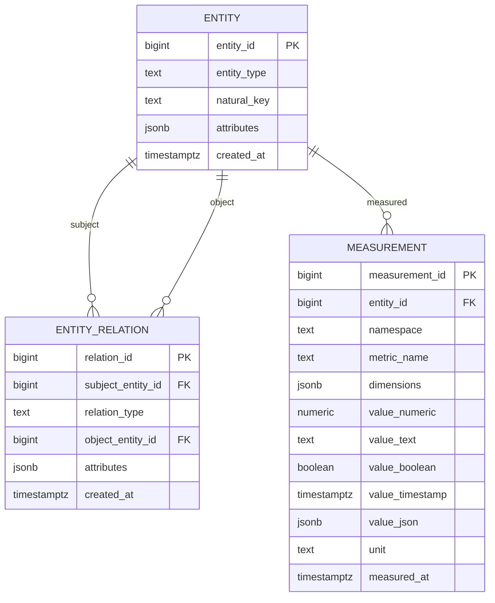
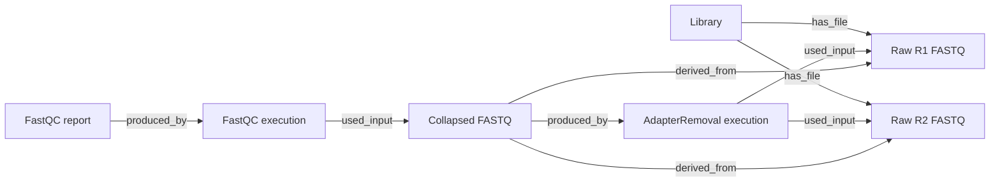

# Abstract entity, relation, and measurement model

This is the recommended highly abstract model for sequencing-file provenance
and QC measurements. It uses three generic tables rather than one table per
bioinformatic tool or report type:

1. `entity` stores identifiable things such as libraries, files, pipeline
   runs, and individual process executions.
2. `entity_relation` stores provenance and other relationships between those
   entities.
3. `measurement` stores QC and processing metrics in long form.

Separating relationships from measurements preserves the flexibility of a
long-form model without mixing provenance edges and measured values in one
table.

## Entity-relationship diagram

## Example lineage

Every box in this flow is an `entity` row. Every labelled arrow is an
`entity_relation` row. Metrics from the FastQC report are `measurement` rows
associated with the collapsed FASTQ, the FastQC execution, or the report,
depending on the measurement's intended subject.

## Example `entity` data

| entity_id | entity_type | natural_key | attributes |
|---:|---|---|---|
| 1 | `library` | `LV7001234567` | `{}` |
| 2 | `file` | `/data/L001_R1.fastq.gz` | `{"format":"fastq","stage":"raw","read_role":"R1"}` |
| 3 | `file` | `/data/L001_R2.fastq.gz` | `{"format":"fastq","stage":"raw","read_role":"R2"}` |
| 4 | `pipeline_run` | `pipeline-run-20260717-001` | `{"version":"v1.0.8","pipeline_hash":"abc123"}` |
| 5 | `process_execution` | `adapterremoval-execution-001` | `{"process":"AdapterRemoval","version":"2.3.3"}` |
| 6 | `file` | `/data/collapsed.fastq.gz` | `{"format":"fastq","stage":"trimmed","read_role":"collapsed"}` |
| 7 | `process_execution` | `fastqc-execution-001` | `{"process":"FastQC","version":"0.12.1"}` |
| 8 | `file` | `/data/collapsed_fastqc.zip` | `{"format":"zip","artifact_role":"qc_report"}` |

`natural_key` is unique within an entity type. For a file it can be its
canonical path or checksum-based identifier. For an execution it should be a
stable execution UUID rather than a display name.

## Example `entity_relation` data

| relation_id | subject | relation_type | object | Meaning |
|---:|---|---|---|---|
| 1 | Raw R1 file | `belongs_to` | Library | R1 belongs to the library |
| 2 | Raw R2 file | `belongs_to` | Library | R2 belongs to the library |
| 3 | AdapterRemoval execution | `part_of` | Pipeline run | Process is part of the run |
| 4 | AdapterRemoval execution | `used_input` | Raw R1 file | Process consumed R1 |
| 5 | AdapterRemoval execution | `used_input` | Raw R2 file | Process consumed R2 |
| 6 | Collapsed FASTQ | `produced_by` | AdapterRemoval execution | Process produced the file |
| 7 | Collapsed FASTQ | `derived_from` | Raw R1 file | File lineage |
| 8 | Collapsed FASTQ | `derived_from` | Raw R2 file | File lineage |
| 9 | FastQC execution | `part_of` | Pipeline run | Process is part of the run |
| 10 | FastQC execution | `used_input` | Collapsed FASTQ | FastQC measured this file |
| 11 | FastQC report | `produced_by` | FastQC execution | FastQC generated the report |

The relation table supports one or many inputs and outputs without special
columns. For example, a merge process can have eight `used_input` relations
and one `produced_by` output relationship.

## Example `measurement` data

| entity | namespace | metric_name | dimensions | value | unit |
|---|---|---|---|---:|---|
| Raw R1 file | `fastqc.basic` | `total_sequences` | `{}` | 12,345,678 | `reads` |
| Raw R1 file | `fastqc.basic` | `gc_percent` | `{}` | 48.0 | `percent` |
| Raw R1 file | `fastqc.per_base_quality` | `mean` | `{"base":"1-5"}` | 34.2 | `phred` |
| Raw R1 file | `fastqc.module_status` | `status` | `{"module":"Adapter Content"}` | `warn` | — |
| Collapsed FASTQ | `fastqc.sequence_duplication` | `deduplicated_percent` | `{}` | 72.8 | `percent` |
| BAM file | `samtools.stats` | `reads_mapped` | `{}` | 11,987,654 | `reads` |
| Pipeline run | `nonpareil` | `diversity` | `{}` | 18.7 | — |

Only one typed value column should be populated for each measurement. A
database check constraint can enforce this with `num_nonnulls(...) = 1`.

`dimensions` represents the coordinates of repeated measurements without
requiring new columns. Examples include base ranges, quality scores, GC
percentages, adapter names, and duplication levels.

## Advantages

- New tools and metrics usually require no schema migration.
- One provenance model handles processes with one or many inputs and outputs.
- File-to-file and process-to-file lineage can be traversed as a graph.
- Long-form measurements work naturally with plotting and analytical tools.
- JSON dimensions accommodate tool-specific axes without wide sparse tables.
- Libraries, files, pipeline runs, and process executions use the same entity
  identity mechanism.
- Tool-specific views can present conventional wide tables when needed.
- The model supports measurements attached to a file, process, report, or
  complete pipeline run.

## Disadvantages

- The database cannot easily require a particular set of metrics for a tool.
- Metric-name spelling errors can silently create new metrics.
- Value types and units require strong ingestion-time validation.
- Conventional reports need pivots or tool-specific views.
- Graph traversal and EAV-style queries are more complex than ordinary joins.
- The measurement table can grow very large and may need partitioning.
- JSON dimension predicates require deliberate GIN or expression indexes.
- Referential integrity confirms that entities exist, but not that every
  relation type is semantically valid between two entity types.
- Renaming a metric or relation requires data governance rather than a simple
  column rename.

## Recommended safeguards

Even with this abstract structure, use controlled vocabularies and database
constraints:

- Restrict `entity_type` to known values.
- Restrict `relation_type` to known provenance relationships.
- Require uniqueness of `(entity_type, natural_key)`.
- Enforce exactly one typed value per measurement.
- Establish stable namespaces such as `fastqc.basic` and `samtools.stats`.
- Define canonical metric names and units in loader code or, eventually, a
  small metric-definition registry.
- Add B-tree indexes for entity and metric lookup.
- Add a GIN index on `measurement.dimensions`.
- Consider partitioning measurements by namespace or ingestion date once the
  data volume warrants it.
- Create validated views for frequently queried tools and reports.

## When to choose this model

This model is a good fit when tools, metrics, and pipeline structures change
frequently and complete provenance matters more than rigid tool-specific
schemas. A strongly typed table per tool remains preferable when strict
database-level validation and simple reporting are the highest priorities.
