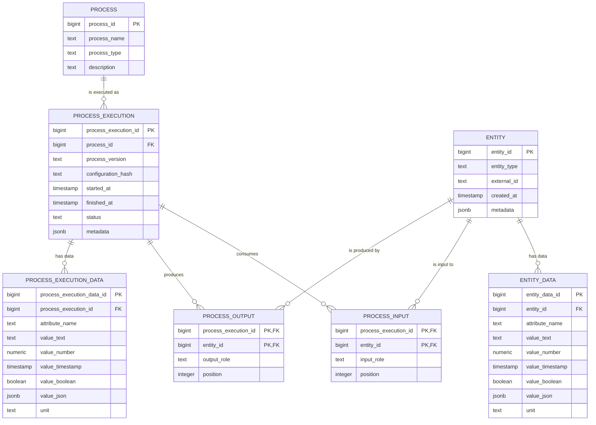
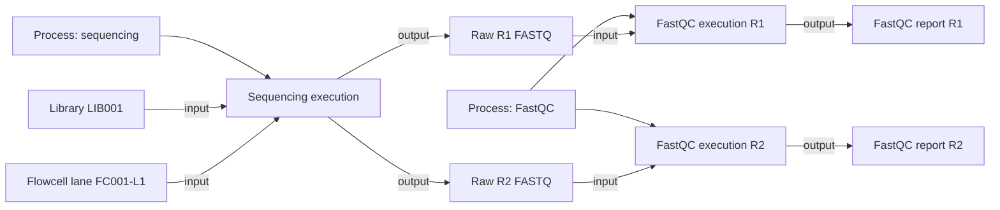

# Abstract Scientific Provenance Model with Processes

## Recommendation

Yes, it makes sense to include a process table because **samples and files are things**, while **processes are events that transform or generate those things**.

The main distinction should be:

- `entity`: a sample, library, lane, file, or other persistent object.
- `process`: a reusable process definition, such as sequencing, demultiplexing, trimming, or FastQC.
- `process_execution`: one actual occurrence of a process.
- `process_input`: associates input entities with a process execution.
- `process_output`: associates output entities with a process execution.
- `entity_data`: flexible measurements and metadata about entities.
- `process_execution_data`: flexible measurements and metadata about executions.

---

## Process definition versus process execution

A process definition represents a general activity or method, for example:

- Illumina sequencing
- bcl-convert demultiplexing
- AdapterRemoval
- FastQC
- taxonomic classification

A process execution represents one particular occurrence of that process, for example:

> FastQC executed on `LIB001_L001_R1.fastq.gz` on July 17, 2026, using FastQC version 0.12.1 and configuration hash `abc123`.

The same process definition may be executed thousands of times.

---

## Recommended entity-relationship model



---

## Example provenance workflow



---

## Example `process` records

| process_id | process_name | process_type |
|---:|---|---|
| 1 | Illumina sequencing | sequencing |
| 2 | bcl-convert | demultiplexing |
| 3 | AdapterRemoval | read_processing |
| 4 | FastQC | quality_control |

---

## Example `process_execution` records

| process_execution_id | process_id | process_version | configuration_hash | status |
|---:|---:|---|---|---|
| 100 | 1 | NovaSeq X software 1.3 | run-config-001 | completed |
| 101 | 2 | 4.2.7 | demux-abc123 | completed |
| 102 | 3 | 2.3.3 | trim-def456 | completed |
| 103 | 4 | 0.12.1 | qc-789xyz | completed |

Pipeline version and configuration remain independent because both are properties of the execution:

```text
process_execution
    process_id
    process_version
    configuration_hash
```

The same version can therefore be used with multiple configurations, and the same configuration can be used with multiple versions.

---

## Why the process model is useful

A separate process model makes it possible to represent:

- multiple input files processed together;
- one input producing multiple outputs;
- repeated executions using the same input;
- failed, cancelled, and retried executions;
- process start and completion times;
- software and workflow versions;
- configuration hashes;
- execution hosts and working directories;
- commands and parameters;
- process logs;
- laboratory processes as well as bioinformatic processes.

It also creates a clear provenance pattern:

```text
input entity
    -> process execution
    -> output entity
```

---

## One long data table or two?

It is technically possible to use one long data table for both entities and process executions, using columns such as:

```text
owner_type = entity | process_execution
owner_id
```

This is usually not recommended because a normal foreign key cannot guarantee that `owner_id` exists in the table identified by `owner_type`.

The cleaner design uses two long-form tables:

```text
entity_data
process_execution_data
```

This preserves referential integrity and keeps object attributes separate from execution metadata.

An even more abstract alternative is to make both entities and process executions subtypes of a generic `object` table. That would permit one shared long-data table, but it would also make the model more complex and less explicit.

---

## Recommended table set

For this use case, the recommended abstract model is:

```text
entity
process
process_execution
process_input
process_output
entity_data
process_execution_data
```

### Table responsibilities

| Table | Responsibility |
|---|---|
| `entity` | Stores samples, libraries, lanes, files, reports, and other persistent objects |
| `process` | Defines reusable laboratory and bioinformatic process types |
| `process_execution` | Records one actual occurrence of a process |
| `process_input` | Associates one or more input entities with an execution |
| `process_output` | Associates one or more output entities with an execution |
| `entity_data` | Stores flexible entity attributes and measurements |
| `process_execution_data` | Stores flexible execution parameters, statistics, and metadata |

---

## Essential advantages

### Clear separation of objects and transformations

Samples and files are represented independently from the processes that consume or generate them.

### Strong provenance representation

The model naturally supports a directed provenance graph with multiple inputs, multiple outputs, merging, branching, and repeated processing.

### Reusable process definitions

Software tools and laboratory procedures are defined once and referenced by many executions.

### Independent version and configuration tracking

A process execution can record both a version and a configuration hash without making either dependent on the other.

### Flexible metadata

The two long-form data tables allow new measurements and metadata fields to be added without frequent schema migrations.

### Suitable for both laboratory and bioinformatics workflows

The same model can represent extraction, library preparation, sequencing, demultiplexing, trimming, quality control, mapping, and downstream analysis.

---

## Essential disadvantages

### More tables and joins

The model is more complex than a strict two-table entity-attribute-value design.

### Generic tables require governance

Controlled vocabularies are needed for entity types, process types, input roles, output roles, attributes, and units.

### Semantic rules require additional validation

The foreign keys guarantee that referenced records exist, but they do not automatically guarantee that a particular entity type is valid as an input or output for a particular process.

### Long-format queries can be verbose

Common reports may require filtered aggregation, pivots, typed views, or materialized views.

### Process granularity must be defined consistently

The organization must decide whether a pipeline is represented as one high-level execution, many step-level executions, or both.

---

## Final recommendation

Include a separate process model.

Use `entity` for persistent scientific objects and use `process_execution` for transformations or activities. Connect them through explicit `process_input` and `process_output` tables.

This provides a strong balance between abstraction, flexibility, and provenance integrity:

```text
entity
    What exists

process
    What type of activity can occur

process_execution
    What actually happened

process_input / process_output
    What was consumed and produced

entity_data / process_execution_data
    What metadata and measurements were recorded
```
