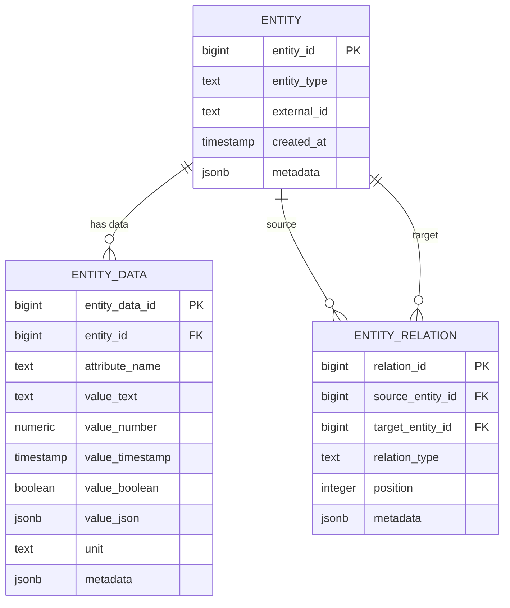
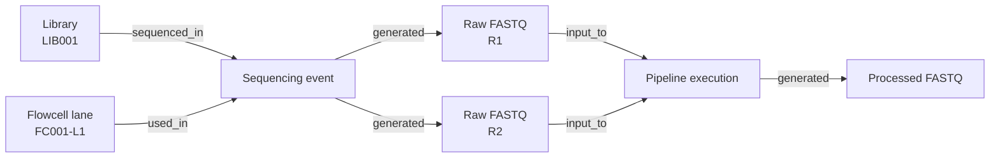

# Abstract Scientific Provenance Model

## Overview

For a highly flexible scientific data model, the recommended design uses three generic tables:

1. `entity` stores samples, libraries, files, sequencing events, pipeline executions, and other identifiable objects.
2. `entity_relation` stores provenance and other relationships between entities.
3. `entity_data` stores variable attributes, measurements, and metadata in long format.

This is more robust than a strict two-table design because scientific provenance is usually a graph rather than a simple parent-child tree.

---

## Conceptual model



---

## Responsibility of each table

### `entity`

The `entity` table answers:

> What object exists?

Examples of entity types:

- field sample
- extract
- library
- flowcell lane
- sequencing event
- raw FASTQ file
- pipeline execution
- processed file
- analysis result

Stable identifiers and object types belong here.

### `entity_relation`

The `entity_relation` table answers:

> How are two objects related?

Examples:

- a library was sequenced in a sequencing event;
- a flowcell lane was used in a sequencing event;
- a sequencing event generated a FASTQ file;
- a FASTQ file was input to a pipeline execution;
- a pipeline execution generated a processed file.

This table allows many-to-many relationships and graph-shaped provenance.

### `entity_data`

The `entity_data` table answers:

> What attribute, measurement, or metadata value was recorded for an object?

Examples:

- library type;
- lane number;
- read direction;
- file size;
- pipeline version;
- pipeline configuration hash;
- number of reads;
- GC percentage;
- quality score.

---

## Suggested PostgreSQL schema

```sql
CREATE TABLE entity (
    entity_id bigint GENERATED ALWAYS AS IDENTITY PRIMARY KEY,

    entity_type text NOT NULL,
    external_id text,

    created_at timestamptz NOT NULL DEFAULT now(),
    metadata jsonb NOT NULL DEFAULT '{}'::jsonb,

    UNIQUE (entity_type, external_id)
);

CREATE TABLE entity_relation (
    relation_id bigint GENERATED ALWAYS AS IDENTITY PRIMARY KEY,

    source_entity_id bigint NOT NULL
        REFERENCES entity(entity_id)
        ON DELETE CASCADE,

    target_entity_id bigint NOT NULL
        REFERENCES entity(entity_id)
        ON DELETE CASCADE,

    relation_type text NOT NULL,
    position integer,
    metadata jsonb NOT NULL DEFAULT '{}'::jsonb,

    CHECK (source_entity_id <> target_entity_id),

    UNIQUE (
        source_entity_id,
        target_entity_id,
        relation_type
    )
);

CREATE TABLE entity_data (
    entity_data_id bigint GENERATED ALWAYS AS IDENTITY PRIMARY KEY,

    entity_id bigint NOT NULL
        REFERENCES entity(entity_id)
        ON DELETE CASCADE,

    attribute_name text NOT NULL,

    value_text text,
    value_number numeric,
    value_timestamp timestamptz,
    value_boolean boolean,
    value_json jsonb,

    unit text,
    metadata jsonb NOT NULL DEFAULT '{}'::jsonb,

    CHECK (
        num_nonnulls(
            value_text,
            value_number,
            value_timestamp,
            value_boolean,
            value_json
        ) = 1
    )
);
```

Recommended indexes:

```sql
CREATE INDEX entity_type_idx
    ON entity (entity_type);

CREATE INDEX entity_external_id_idx
    ON entity (external_id);

CREATE INDEX entity_relation_source_idx
    ON entity_relation (source_entity_id);

CREATE INDEX entity_relation_target_idx
    ON entity_relation (target_entity_id);

CREATE INDEX entity_relation_type_idx
    ON entity_relation (relation_type);

CREATE INDEX entity_data_entity_idx
    ON entity_data (entity_id);

CREATE INDEX entity_data_attribute_idx
    ON entity_data (attribute_name);

CREATE INDEX entity_data_entity_attribute_idx
    ON entity_data (entity_id, attribute_name);
```

---

## Example workflow

Assume:

- library `LIB001` is sequenced on flowcell lane `FC001-L1`;
- paired-end sequencing generates R1 and R2 FASTQ files;
- both FASTQ files are processed with pipeline version `1.0.8`;
- the pipeline configuration is identified by hash `abc123`;
- the execution produces a trimmed FASTQ file.

### Provenance flow



---

## Example `entity` records

| entity_id | entity_type | external_id |
|---:|---|---|
| 1 | library | LIB001 |
| 2 | flowcell_lane | FC001-L1 |
| 3 | sequencing_event | SEQ-LIB001-FC001-L1 |
| 4 | raw_fastq_file | LIB001_L001_R1.fastq.gz |
| 5 | raw_fastq_file | LIB001_L001_R2.fastq.gz |
| 6 | pipeline_execution | EXEC-1001 |
| 7 | processed_file | LIB001.trimmed.fastq.gz |

Equivalent inserts:

```sql
INSERT INTO entity (entity_id, entity_type, external_id)
VALUES
    (1, 'library', 'LIB001'),
    (2, 'flowcell_lane', 'FC001-L1'),
    (3, 'sequencing_event', 'SEQ-LIB001-FC001-L1'),
    (4, 'raw_fastq_file', 'LIB001_L001_R1.fastq.gz'),
    (5, 'raw_fastq_file', 'LIB001_L001_R2.fastq.gz'),
    (6, 'pipeline_execution', 'EXEC-1001'),
    (7, 'processed_file', 'LIB001.trimmed.fastq.gz');
```

When inserting explicit values into a `GENERATED ALWAYS AS IDENTITY` column in PostgreSQL, use `OVERRIDING SYSTEM VALUE`, or omit `entity_id` and use the generated IDs.

---

## Example `entity_relation` records

| source_entity_id | relation_type | target_entity_id | Meaning |
|---:|---|---:|---|
| 1 | sequenced_in | 3 | Library participated in sequencing event |
| 2 | used_in | 3 | Flowcell lane participated in sequencing event |
| 3 | generated | 4 | Sequencing event generated R1 |
| 3 | generated | 5 | Sequencing event generated R2 |
| 4 | input_to | 6 | R1 was input to pipeline execution |
| 5 | input_to | 6 | R2 was input to pipeline execution |
| 6 | generated | 7 | Pipeline execution generated processed file |

Equivalent inserts:

```sql
INSERT INTO entity_relation (
    source_entity_id,
    relation_type,
    target_entity_id
)
VALUES
    (1, 'sequenced_in', 3),
    (2, 'used_in', 3),
    (3, 'generated', 4),
    (3, 'generated', 5),
    (4, 'input_to', 6),
    (5, 'input_to', 6),
    (6, 'generated', 7);
```

---

## Example `entity_data` records

| entity_id | attribute_name | Value | Unit |
|---:|---|---|---|
| 1 | library_type | ancient_dna | |
| 2 | lane_number | 1 | |
| 4 | read_direction | R1 | |
| 4 | file_path | `/data/raw/LIB001_L001_R1.fastq.gz` | |
| 4 | file_size_bytes | 182736452 | bytes |
| 5 | read_direction | R2 | |
| 5 | file_path | `/data/raw/LIB001_L001_R2.fastq.gz` | |
| 6 | pipeline_name | qc_pipeline | |
| 6 | pipeline_version | 1.0.8 | |
| 6 | pipeline_hash | abc123 | |
| 6 | status | completed | |
| 7 | file_path | `/data/processed/LIB001.trimmed.fastq.gz` | |
| 7 | number_of_reads | 14500000 | reads |
| 7 | gc_percentage | 42.7 | percent |

Equivalent inserts:

```sql
INSERT INTO entity_data (
    entity_id,
    attribute_name,
    value_text,
    value_number,
    unit
)
VALUES
    (1, 'library_type', 'ancient_dna', NULL, NULL),

    (2, 'lane_number', NULL, 1, NULL),

    (4, 'read_direction', 'R1', NULL, NULL),
    (4, 'file_path', '/data/raw/LIB001_L001_R1.fastq.gz', NULL, NULL),
    (4, 'file_size_bytes', NULL, 182736452, 'bytes'),

    (5, 'read_direction', 'R2', NULL, NULL),
    (5, 'file_path', '/data/raw/LIB001_L001_R2.fastq.gz', NULL, NULL),

    (6, 'pipeline_name', 'qc_pipeline', NULL, NULL),
    (6, 'pipeline_version', '1.0.8', NULL, NULL),
    (6, 'pipeline_hash', 'abc123', NULL, NULL),
    (6, 'status', 'completed', NULL, NULL),

    (7, 'file_path', '/data/processed/LIB001.trimmed.fastq.gz', NULL, NULL),
    (7, 'number_of_reads', NULL, 14500000, 'reads'),
    (7, 'gc_percentage', NULL, 42.7, 'percent');
```

---

## Example provenance query

The following recursive query walks forward from a library through all related entities:

```sql
WITH RECURSIVE provenance AS (
    SELECT
        e.entity_id,
        e.entity_type,
        e.external_id,
        0 AS depth,
        ARRAY[e.entity_id] AS visited
    FROM entity e
    WHERE e.entity_type = 'library'
      AND e.external_id = 'LIB001'

    UNION ALL

    SELECT
        target.entity_id,
        target.entity_type,
        target.external_id,
        provenance.depth + 1,
        provenance.visited || target.entity_id
    FROM provenance
    JOIN entity_relation r
      ON r.source_entity_id = provenance.entity_id
    JOIN entity target
      ON target.entity_id = r.target_entity_id
    WHERE NOT target.entity_id = ANY (provenance.visited)
)
SELECT
    entity_id,
    entity_type,
    external_id,
    depth
FROM provenance
ORDER BY depth, entity_id;
```

The `visited` array protects the query from accidental cycles.

---

## Essential advantages

### Highly flexible

New entity types, relationship types, attributes, and measurements can be introduced without adding operational tables or columns.

### Suitable for heterogeneous scientific data

The model can accommodate laboratory, sequencing, file, bioinformatics, and analysis data in the same general structure.

### Supports graph-shaped provenance

The relationship table supports:

- one-to-many relationships;
- many-to-many relationships;
- multiple inputs;
- multiple outputs;
- repeated processing;
- merged lanes;
- files processed by several pipelines.

### Avoids very wide sparse tables

Attributes that apply only to a small subset of entities do not require mostly-null columns.

### Useful for ingestion and staging

The design can absorb data from changing spreadsheets, pipelines, instruments, and legacy systems with relatively few schema migrations.

---

## Essential disadvantages

### Weak semantic validation

The database does not inherently know which attributes are valid for each entity type.

For example, it may accept:

```text
entity_type = library
attribute_name = file_size_bytes
```

even when that combination is meaningless.

### Required attributes are harder to enforce

A conventional `library` table can require `library_id`, `library_type`, and preparation date through `NOT NULL` constraints. In a long model, these rules usually require triggers, validation procedures, or application logic.

### Attribute-name inconsistency

Without governance, the data may contain several names for the same concept:

```text
pipeline_version
pipeline_ver
workflow_version
version
```

### Queries are more complicated

Retrieving several attributes often requires filtered aggregation, pivots, or repeated joins.

### Performance can deteriorate

A large `entity_data` table may contain millions or billions of rows. Careful indexing, partitioning, and materialized views may be needed.

### Data types are less natural

Typed value columns reduce some risk, but the application must still know which value column corresponds to each attribute.

### Relationship rules are generic

The database can ensure that both entities exist, but it does not automatically know that:

- a `raw_fastq_file` may be `input_to` a `pipeline_execution`;
- a `library` should not be `generated` by a FASTQ file;
- a sequencing event should have at least one library and one lane.

### Reporting is less convenient

Analytical users generally prefer typed, wide views rather than querying the generic long-form tables directly.

---

## Recommended safeguards

The abstract model should be supplemented with controlled vocabulary and validation tables.

### Entity types

```sql
CREATE TABLE allowed_entity_type (
    entity_type text PRIMARY KEY
);
```

### Relation types

```sql
CREATE TABLE allowed_relation_type (
    relation_type text PRIMARY KEY
);
```

### Attribute definitions

```sql
CREATE TABLE attribute_definition (
    attribute_name text PRIMARY KEY,
    expected_value_type text NOT NULL,
    default_unit text,
    description text
);
```

### Entity-type attribute rules

```sql
CREATE TABLE entity_type_attribute (
    entity_type text NOT NULL,
    attribute_name text NOT NULL,
    is_required boolean NOT NULL DEFAULT false,

    PRIMARY KEY (entity_type, attribute_name)
);
```

### Relation rules

A relation-rule table can define which source and target types are valid for each relation:

```sql
CREATE TABLE entity_relation_rule (
    relation_type text NOT NULL,
    source_entity_type text NOT NULL,
    target_entity_type text NOT NULL,

    PRIMARY KEY (
        relation_type,
        source_entity_type,
        target_entity_type
    )
);
```

These control tables make the design less permissive while retaining most of its flexibility.

---

## Recommended usage pattern

Use the generic tables as the canonical provenance and metadata layer:

```text
entity
    Stable identity

entity_relation
    Stable provenance graph

entity_data
    Flexible attributes and measurements
```

Expose typed views for application and reporting use.

Example:

```sql
CREATE VIEW library_summary AS
SELECT
    e.entity_id,
    e.external_id AS library_id,

    max(d.value_text)
        FILTER (WHERE d.attribute_name = 'library_type')
        AS library_type,

    max(d.value_timestamp)
        FILTER (WHERE d.attribute_name = 'preparation_date')
        AS preparation_date

FROM entity e
LEFT JOIN entity_data d
  ON d.entity_id = e.entity_id

WHERE e.entity_type = 'library'

GROUP BY
    e.entity_id,
    e.external_id;
```

This provides flexibility in storage while giving users and applications a conventional relational interface.

---

## Recommendation

The three-table model is a reasonable choice when:

- the set of entity and measurement types changes frequently;
- provenance flexibility is a primary requirement;
- data comes from heterogeneous sources;
- schema migrations are costly;
- the generic tables are treated as an underlying metadata layer.

It is less suitable as the only user-facing model for operational workflows with strict validation requirements.

The strongest practical design is therefore:

1. use `entity`, `entity_relation`, and `entity_data` for flexible provenance and metadata;
2. define controlled vocabularies and validation rules;
3. expose typed views or materialized views for common entities and reports;
4. retain dedicated relational tables for especially stable, business-critical data when strict constraints are required.
