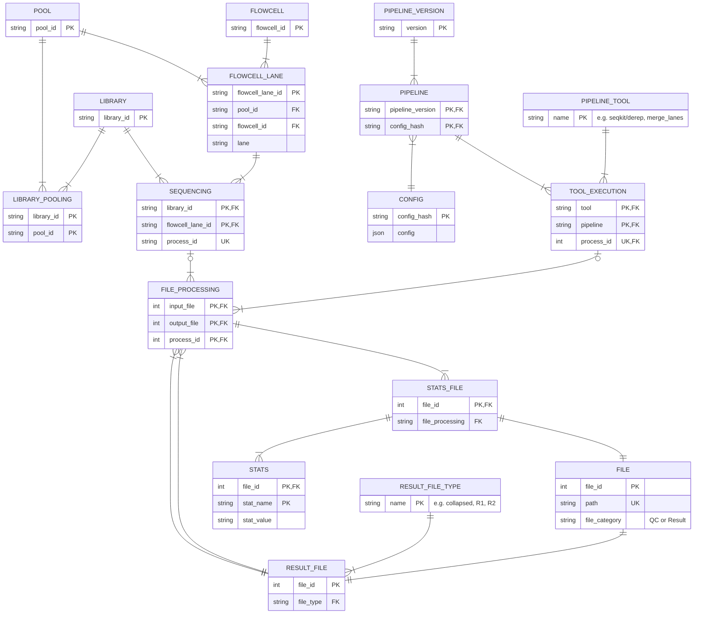

```mermaid
erDiagram
    POOL ||--|{ FLOWCELL_LANE : ""
    FLOWCELL ||--|{ FLOWCELL_LANE : ""

    POOL ||--|{ LIBRARY_POOLING : ""
    LIBRARY ||--|{ LIBRARY_POOLING : ""

    LIBRARY ||--|{ SEQUENCING : ""
    FLOWCELL_LANE ||--|{ SEQUENCING : ""

    PIPELINE_VERSION ||--|{ PIPELINE : ""

    PIPELINE }|--|| CONFIG : ""
    
    SEQUENCING o|--|{ FILE_PROCESSING : ""

    PIPELINE ||--|{ TOOL_EXECUTION : ""
    TOOL_EXECUTION o|--|{ FILE_PROCESSING : ""
    PIPELINE_TOOL ||--|{ TOOL_EXECUTION : ""
    FILE_PROCESSING  }|--|| RESULT_FILE : ""
    FILE_PROCESSING  }|--|| RESULT_FILE : ""
    RESULT_FILE_TYPE ||--|{ RESULT_FILE : ""
    FILE ||--|| RESULT_FILE : ""
    STATS_FILE ||--|| FILE : ""
    FILE_PROCESSING ||--|{ STATS_FILE : ""
    STATS_FILE ||--|{ STATS : ""


    FILE_PROCESSING {
        int input_file PK, FK
        int output_file PK, FK
        int process_id PK, FK
    }

    RESULT_FILE_TYPE {
        string name PK "e.g. collapsed, R1, R2" 
    }


    LIBRARY {
        string library_id PK
    }

    POOL {
        string pool_id PK
    }

    FLOWCELL {
        string flowcell_id PK
    }

    FLOWCELL_LANE {
        string flowcell_lane_id PK
        string pool_id FK
        string flowcell_id FK
        string lane
    }

    SEQUENCING {
        string library_id PK, FK
        string flowcell_lane_id PK, FK
        string process_id UK
    }

    LIBRARY_POOLING {
        string library_id PK
        string pool_id PK
    }

    CONFIG { 
        string config_hash PK
        json config
    }

    PIPELINE_VERSION {
        string version PK
    }

    PIPELINE {
        string pipeline_version PK, FK
        string config_hash PK, FK
    }

   
    RESULT_FILE {
        int file_id PK
        string file_type FK
    }


    PIPELINE_TOOL {
        string name PK "e.g. seqkit/derep, merge_lanes"
    }

    TOOL_EXECUTION {
        string tool PK, FK
        string pipeline PK, FK
        int process_id UK, FK
    }

    STATS_FILE {
        int file_id PK, FK
        string file_processing FK
    }

    FILE {
        int file_id PK
        string path UK
        string file_category "QC or Result"
    }

    STATS{
        int file_id PK, FK
        string stat_name PK
        string stat_value
    }


```
