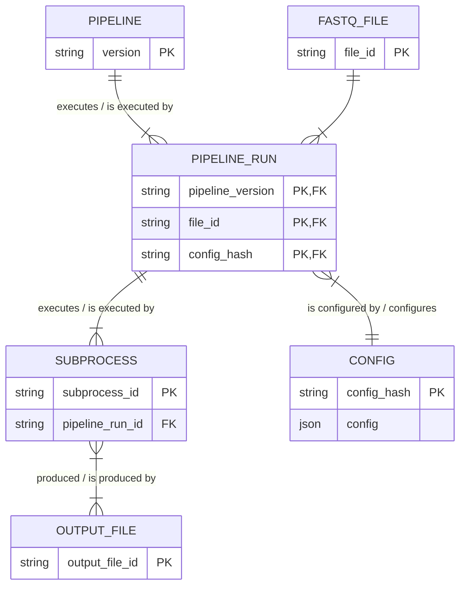

# Pipeline execution and subprocesses

Question: Do we want to split up subprocess into specific process tables or keep it abstract?
Not sure if we should make a dataset table? A dataset is  all the fastq IDs from one library. Filipe says that this is what each pipeline run is processing.
