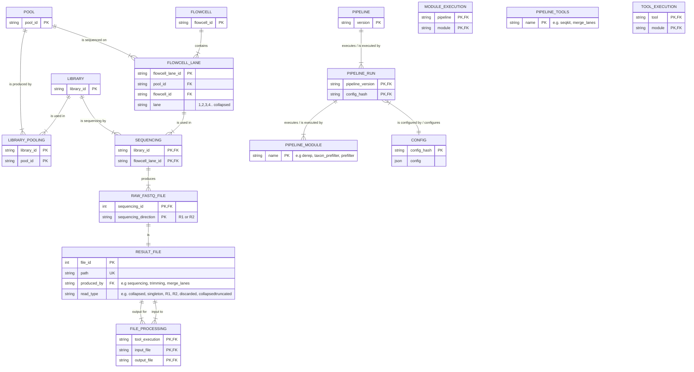

NOTE: A pipeline is defined by a run of a single file. However a subprocess
More normalization: A general process table that can keep information of everything that has one or more inputs and produces one or more outputs. Inp