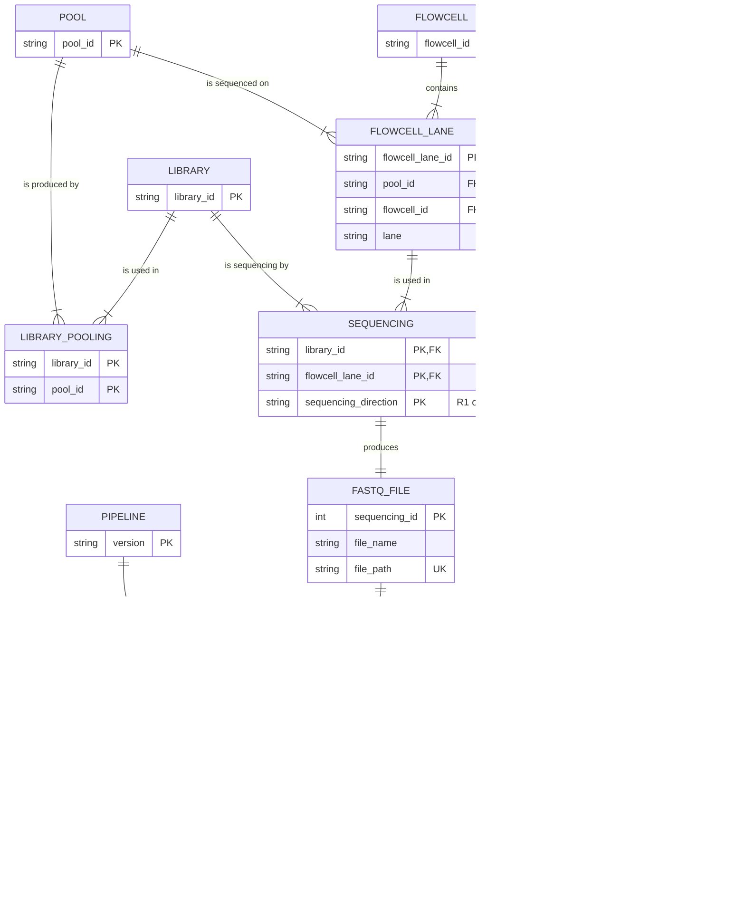

```mermaid
erDiagram
    POOL ||--|{ FLOWCELL_LANE : "is sequenced on"
    FLOWCELL ||--|{ FLOWCELL_LANE : "contains"

    POOL ||--|{ LIBRARY_POOLING : "is produced by"
    LIBRARY ||--|{ LIBRARY_POOLING : "is used in"

    LIBRARY ||--|{ SEQUENCING : "is sequencing by"
    FLOWCELL_LANE ||--|{ SEQUENCING : "is used in"

    SEQUENCING ||--|| FASTQ_FILE : "produces"

    PIPELINE ||--|{ PIPELINE_RUN : "executes / is executed by"

    FASTQ_FILE ||--|{ PIPELINE_RUN : ""

    PIPELINE_RUN ||--|{ SUBPROCESS : "executes / is executed by"
    PIPELINE_RUN }|--|| CONFIG : "is configured by / configures"


    LIBRARY {
        string library_id PK
    }

    POOL {
        string pool_id PK
    }

    FLOWCELL {
        string flowcell_id PK
    }

    FLOWCELL_LANE {
        string flowcell_lane_id PK
        string pool_id FK
        string flowcell_id FK
        string lane
    }

    SEQUENCING {
        string library_id PK, FK
        string flowcell_lane_id PK, FK
        string sequencing_direction PK "R1 or R2"
    }

    LIBRARY_POOLING {
        string library_id PK
        string pool_id PK
    }

    FASTQ_FILE {
        int sequencing_id PK
        string file_name
        string file_path UK
    }

        CONFIG { 
        string config_hash PK
        json config
    }

    PIPELINE {
        string version PK
    }

    PIPELINE_RUN {
        string pipeline_version PK, FK
        string file_id PK, FK
        string config_hash PK, FK
    }


    SUBPROCESS {
        string subprocess_id PK
        string pipeline_run_id FK
    }

    OUTPUT_FILE {
        string output_file_id PK
    }


```
