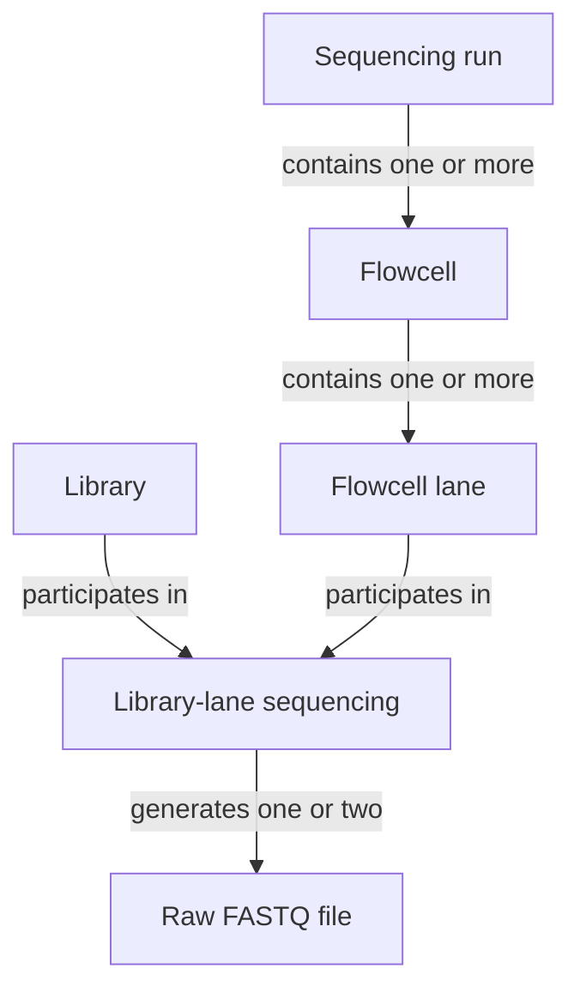

# High-level sequencing model

```mermaid
flowchart TD
    RUN[Sequencing run]
    FC[Flowcell]
    LANE[Flowcell lane]
    LIB[Library]
    LLS[Library-lane sequencing]
    FASTQ[Raw FASTQ file]

    RUN -->|contains one or more| FC
    FC -->|contains one or more| LANE

    LIB -->|participates in| LLS
    LANE -->|participates in| LLS

    LLS -->|generates one or two| FASTQ
```
