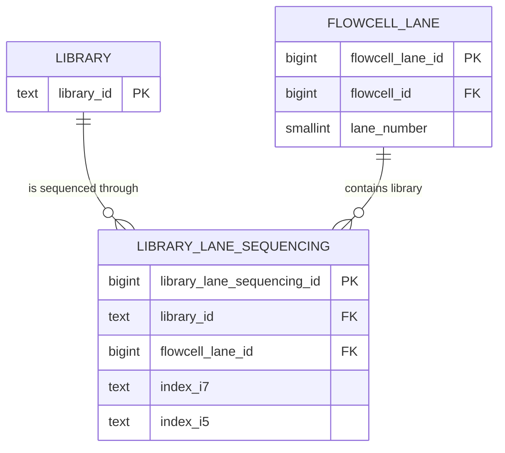

# Library-lane many-to-many relationship

```mermaid
erDiagram
    LIBRARY ||--o{ LIBRARY_LANE_SEQUENCING : "is sequenced through"
    FLOWCELL_LANE ||--o{ LIBRARY_LANE_SEQUENCING : "contains library"

    LIBRARY {
        text library_id PK
    }

    FLOWCELL_LANE {
        bigint flowcell_lane_id PK
        bigint flowcell_id FK
        smallint lane_number
    }

    LIBRARY_LANE_SEQUENCING {
        bigint library_lane_sequencing_id PK
        text library_id FK
        bigint flowcell_lane_id FK
        text index_i7
        text index_i5
    }
```
