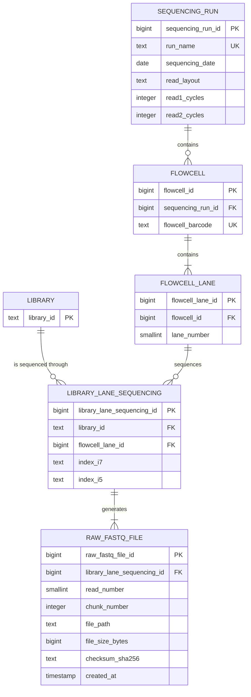

# Sequencing and raw FASTQ model

```mermaid
erDiagram
    SEQUENCING_RUN ||--o{ FLOWCELL : contains
    FLOWCELL ||--|{ FLOWCELL_LANE : contains

    LIBRARY ||--o{ LIBRARY_LANE_SEQUENCING : "is sequenced through"
    FLOWCELL_LANE ||--o{ LIBRARY_LANE_SEQUENCING : "sequences"

    LIBRARY_LANE_SEQUENCING ||--|{ RAW_FASTQ_FILE : generates

    SEQUENCING_RUN {
        bigint sequencing_run_id PK
        text run_name UK
        date sequencing_date
        text read_layout
        integer read1_cycles
        integer read2_cycles
    }

    FLOWCELL {
        bigint flowcell_id PK
        bigint sequencing_run_id FK
        text flowcell_barcode UK
    }

    FLOWCELL_LANE {
        bigint flowcell_lane_id PK
        bigint flowcell_id FK
        smallint lane_number
    }

    LIBRARY {
        text library_id PK
    }

    LIBRARY_LANE_SEQUENCING {
        bigint library_lane_sequencing_id PK
        text library_id FK
        bigint flowcell_lane_id FK
        text index_i7
        text index_i5
    }

    RAW_FASTQ_FILE {
        bigint raw_fastq_file_id PK
        bigint library_lane_sequencing_id FK
        smallint read_number
        integer chunk_number
        text file_path
        bigint file_size_bytes
        text checksum_sha256
        timestamp created_at
    }
```
