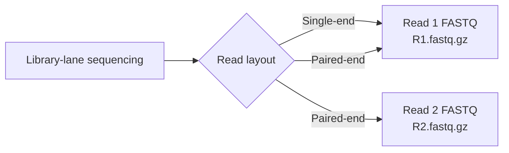

# FASTQ generation by sequencing method

```mermaid
flowchart LR
    LLS[Library-lane sequencing]

    METHOD{Read layout}

    R1[Read 1 FASTQ<br/>R1.fastq.gz]
    R2[Read 2 FASTQ<br/>R2.fastq.gz]

    LLS --> METHOD

    METHOD -->|Single-end| R1
    METHOD -->|Paired-end| R1
    METHOD -->|Paired-end| R2
```
