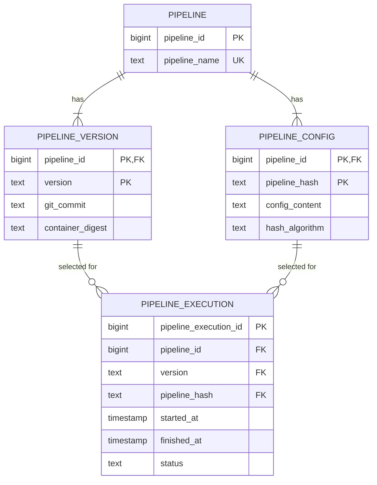
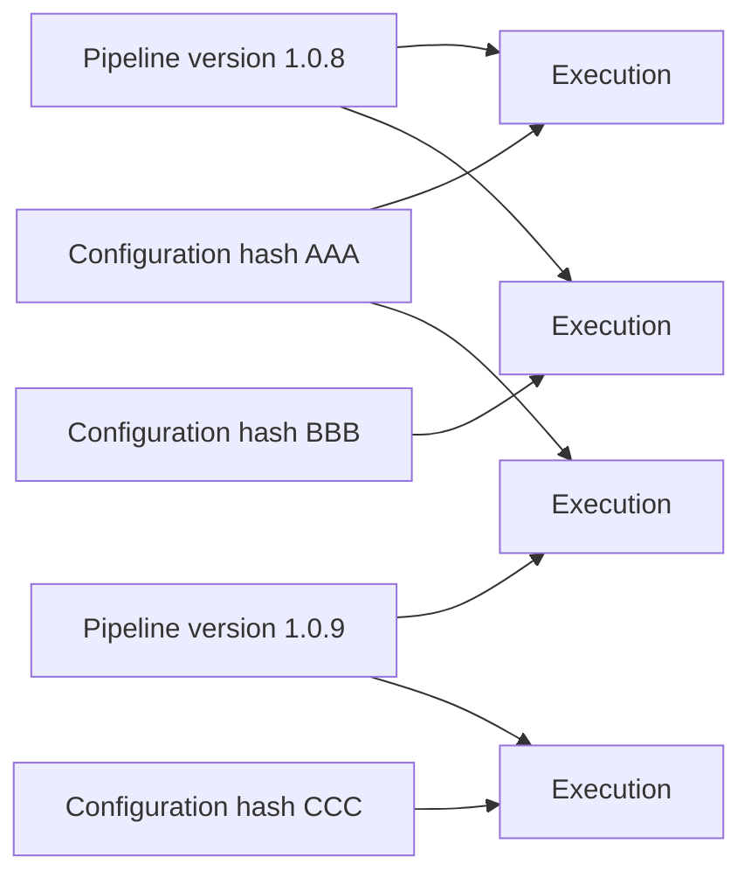

# Independent pipeline version and configuration model

```mermaid
erDiagram
    PIPELINE ||--|{ PIPELINE_VERSION : has
    PIPELINE ||--|{ PIPELINE_CONFIG : has

    PIPELINE_VERSION ||--o{ PIPELINE_EXECUTION : "selected for"
    PIPELINE_CONFIG ||--o{ PIPELINE_EXECUTION : "selected for"

    PIPELINE {
        bigint pipeline_id PK
        text pipeline_name UK
    }

    PIPELINE_VERSION {
        bigint pipeline_id PK, FK
        text version PK
        text git_commit
        text container_digest
    }

    PIPELINE_CONFIG {
        bigint pipeline_id PK, FK
        text pipeline_hash PK
        text config_content
        text hash_algorithm
    }

    PIPELINE_EXECUTION {
        bigint pipeline_execution_id PK
        bigint pipeline_id FK
        text version FK
        text pipeline_hash FK
        timestamp started_at
        timestamp finished_at
        text status
    }
```

```mermaid
flowchart LR
    V1[Pipeline version 1.0.8]
    V2[Pipeline version 1.0.9]

    C1[Configuration hash AAA]
    C2[Configuration hash BBB]
    C3[Configuration hash CCC]

    E1[Execution]
    E2[Execution]
    E3[Execution]
    E4[Execution]

    V1 --> E1
    C1 --> E1

    V1 --> E2
    C2 --> E2

    V2 --> E3
    C1 --> E3

    V2 --> E4
    C3 --> E4
```
