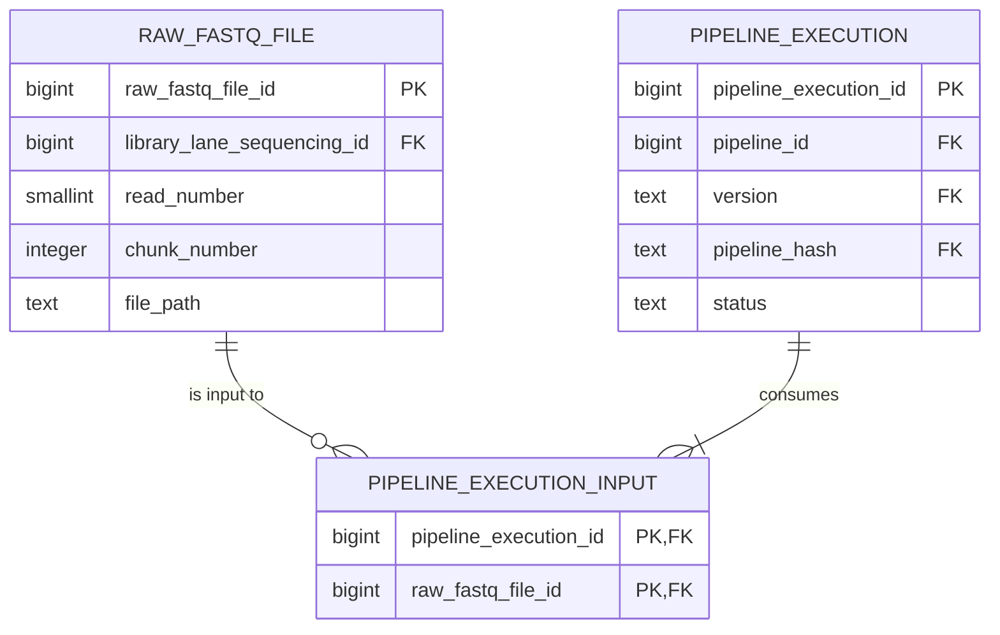

# Pipeline input many-to-many relationship

```mermaid
erDiagram
    RAW_FASTQ_FILE ||--o{ PIPELINE_EXECUTION_INPUT : "is input to"
    PIPELINE_EXECUTION ||--|{ PIPELINE_EXECUTION_INPUT : consumes

    RAW_FASTQ_FILE {
        bigint raw_fastq_file_id PK
        bigint library_lane_sequencing_id FK
        smallint read_number
        integer chunk_number
        text file_path
    }

    PIPELINE_EXECUTION {
        bigint pipeline_execution_id PK
        bigint pipeline_id FK
        text version FK
        text pipeline_hash FK
        text status
    }

    PIPELINE_EXECUTION_INPUT {
        bigint pipeline_execution_id PK, FK
        bigint raw_fastq_file_id PK, FK
    }
```
