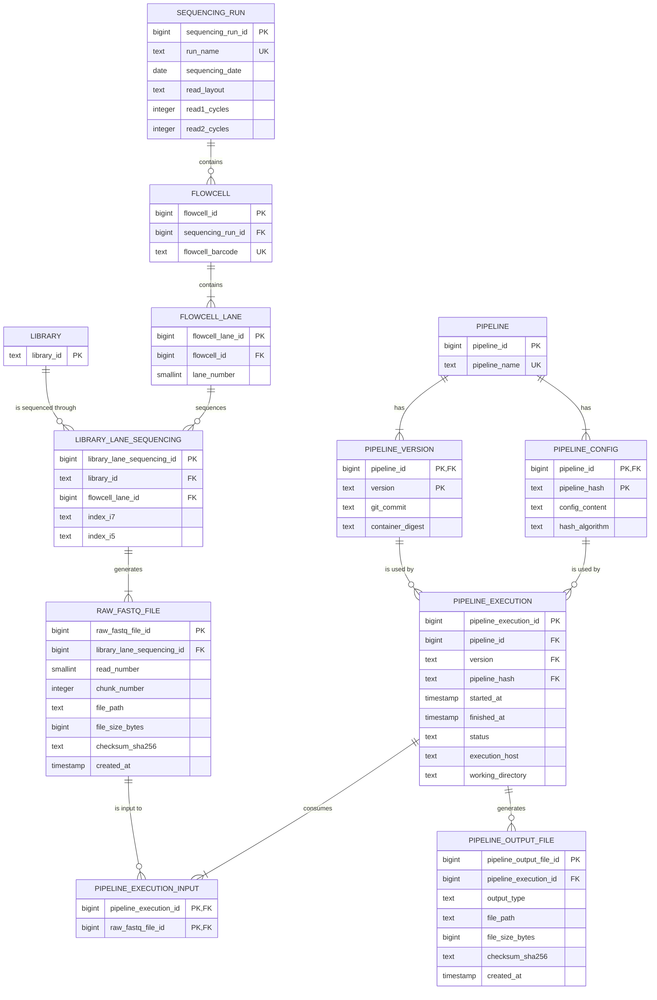

# Complete normalized entity-relationship model

```mermaid
erDiagram
    LIBRARY {
        text library_id PK
    }

    SEQUENCING_RUN {
        bigint sequencing_run_id PK
        text run_name UK
        date sequencing_date
        text read_layout
        integer read1_cycles
        integer read2_cycles
    }

    FLOWCELL {
        bigint flowcell_id PK
        bigint sequencing_run_id FK
        text flowcell_barcode UK
    }

    FLOWCELL_LANE {
        bigint flowcell_lane_id PK
        bigint flowcell_id FK
        smallint lane_number
    }

    LIBRARY_LANE_SEQUENCING {
        bigint library_lane_sequencing_id PK
        text library_id FK
        bigint flowcell_lane_id FK
        text index_i7
        text index_i5
    }

    RAW_FASTQ_FILE {
        bigint raw_fastq_file_id PK
        bigint library_lane_sequencing_id FK
        smallint read_number
        integer chunk_number
        text file_path
        bigint file_size_bytes
        text checksum_sha256
        timestamp created_at
    }

    PIPELINE {
        bigint pipeline_id PK
        text pipeline_name UK
    }

    PIPELINE_VERSION {
        bigint pipeline_id PK, FK
        text version PK
        text git_commit
        text container_digest
    }

    PIPELINE_CONFIG {
        bigint pipeline_id PK, FK
        text pipeline_hash PK
        text config_content
        text hash_algorithm
    }

    PIPELINE_EXECUTION {
        bigint pipeline_execution_id PK
        bigint pipeline_id FK
        text version FK
        text pipeline_hash FK
        timestamp started_at
        timestamp finished_at
        text status
        text execution_host
        text working_directory
    }

    PIPELINE_EXECUTION_INPUT {
        bigint pipeline_execution_id PK, FK
        bigint raw_fastq_file_id PK, FK
    }

    PIPELINE_OUTPUT_FILE {
        bigint pipeline_output_file_id PK
        bigint pipeline_execution_id FK
        text output_type
        text file_path
        bigint file_size_bytes
        text checksum_sha256
        timestamp created_at
    }

    SEQUENCING_RUN ||--o{ FLOWCELL : contains
    FLOWCELL ||--|{ FLOWCELL_LANE : contains

    LIBRARY ||--o{ LIBRARY_LANE_SEQUENCING : "is sequenced through"
    FLOWCELL_LANE ||--o{ LIBRARY_LANE_SEQUENCING : sequences

    LIBRARY_LANE_SEQUENCING ||--|{ RAW_FASTQ_FILE : generates

    PIPELINE ||--|{ PIPELINE_VERSION : has
    PIPELINE ||--|{ PIPELINE_CONFIG : has

    PIPELINE_VERSION ||--o{ PIPELINE_EXECUTION : "is used by"
    PIPELINE_CONFIG ||--o{ PIPELINE_EXECUTION : "is used by"

    PIPELINE_EXECUTION ||--|{ PIPELINE_EXECUTION_INPUT : consumes
    RAW_FASTQ_FILE ||--o{ PIPELINE_EXECUTION_INPUT : "is input to"

    PIPELINE_EXECUTION ||--o{ PIPELINE_OUTPUT_FILE : generates
```
