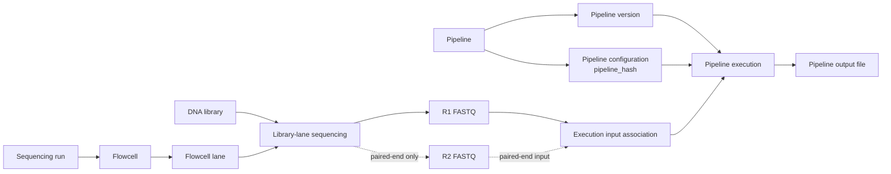

# Complete end-to-end data lineage

```mermaid
flowchart LR
    RUN[Sequencing run]
    FC[Flowcell]
    LANE[Flowcell lane]
    LIB[DNA library]

    LLS[Library-lane sequencing]

    R1[R1 FASTQ]
    R2[R2 FASTQ]

    PIPE[Pipeline]
    VER[Pipeline version]
    CFG[Pipeline configuration<br/>pipeline_hash]

    EXEC[Pipeline execution]
    INPUT[Execution input association]
    OUTPUT[Pipeline output file]

    RUN --> FC
    FC --> LANE

    LIB --> LLS
    LANE --> LLS

    LLS --> R1
    LLS -. paired-end only .-> R2

    PIPE --> VER
    PIPE --> CFG

    VER --> EXEC
    CFG --> EXEC

    R1 --> INPUT
    R2 -. paired-end input .-> INPUT
    INPUT --> EXEC

    EXEC --> OUTPUT
```
