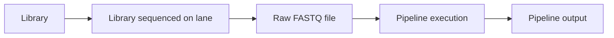

# Compact provenance model

```mermaid
flowchart LR
    LIB[Library]
    PLACEMENT[Library sequenced on lane]
    RAW[Raw FASTQ file]
    EXEC[Pipeline execution]
    RESULT[Pipeline output]

    LIB --> PLACEMENT
    PLACEMENT --> RAW
    RAW --> EXEC
    EXEC --> RESULT
```
