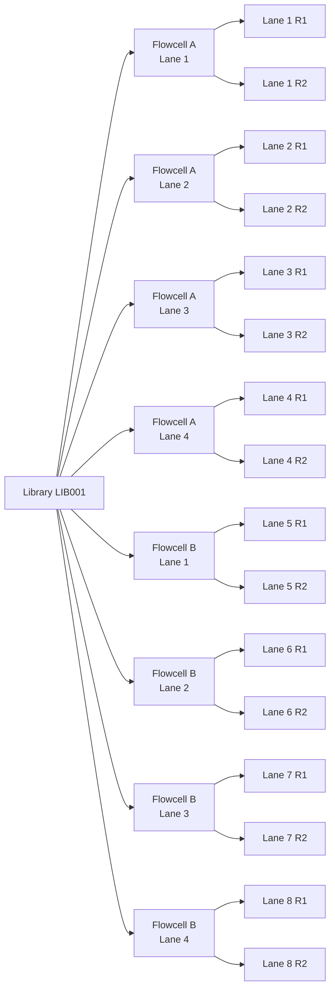

# Paired-end library sequenced on eight lanes

```mermaid
flowchart LR
    LIB[Library LIB001]

    L1[Flowcell A<br/>Lane 1]
    L2[Flowcell A<br/>Lane 2]
    L3[Flowcell A<br/>Lane 3]
    L4[Flowcell A<br/>Lane 4]
    L5[Flowcell B<br/>Lane 1]
    L6[Flowcell B<br/>Lane 2]
    L7[Flowcell B<br/>Lane 3]
    L8[Flowcell B<br/>Lane 4]

    LIB --> L1
    LIB --> L2
    LIB --> L3
    LIB --> L4
    LIB --> L5
    LIB --> L6
    LIB --> L7
    LIB --> L8

    L1 --> L1R1[Lane 1 R1]
    L1 --> L1R2[Lane 1 R2]

    L2 --> L2R1[Lane 2 R1]
    L2 --> L2R2[Lane 2 R2]

    L3 --> L3R1[Lane 3 R1]
    L3 --> L3R2[Lane 3 R2]

    L4 --> L4R1[Lane 4 R1]
    L4 --> L4R2[Lane 4 R2]

    L5 --> L5R1[Lane 5 R1]
    L5 --> L5R2[Lane 5 R2]

    L6 --> L6R1[Lane 6 R1]
    L6 --> L6R2[Lane 6 R2]

    L7 --> L7R1[Lane 7 R1]
    L7 --> L7R2[Lane 7 R2]

    L8 --> L8R1[Lane 8 R1]
    L8 --> L8R2[Lane 8 R2]
```
