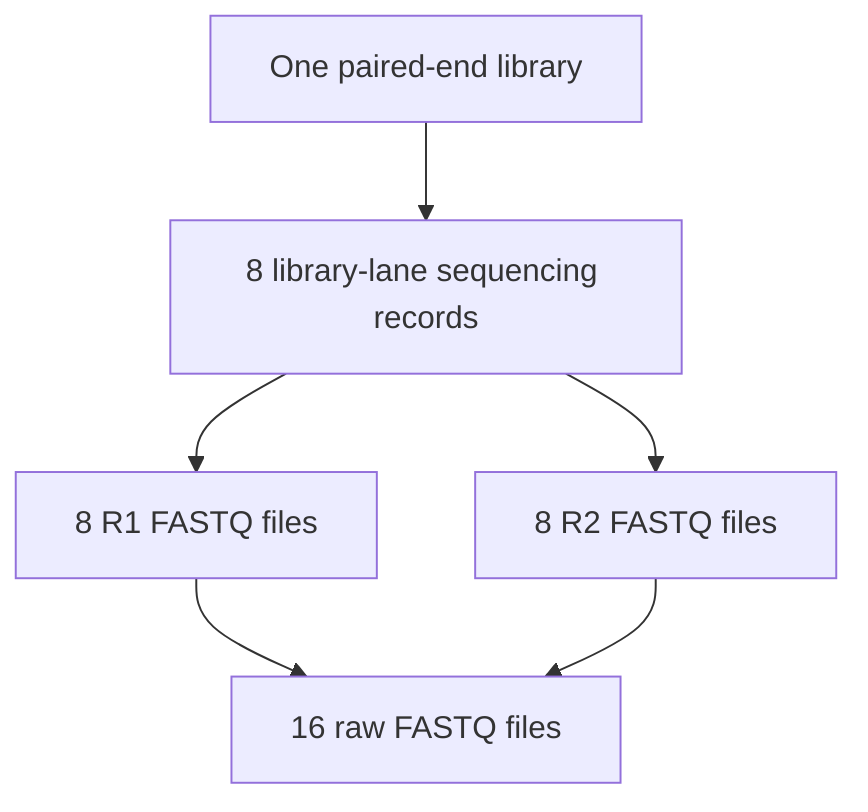

# Paired-end eight-lane file count

```mermaid
flowchart TD
    LIB[One paired-end library]

    LANES[8 library-lane sequencing records]

    R1[8 R1 FASTQ files]
    R2[8 R2 FASTQ files]

    TOTAL[16 raw FASTQ files]

    LIB --> LANES
    LANES --> R1
    LANES --> R2

    R1 --> TOTAL
    R2 --> TOTAL
```
