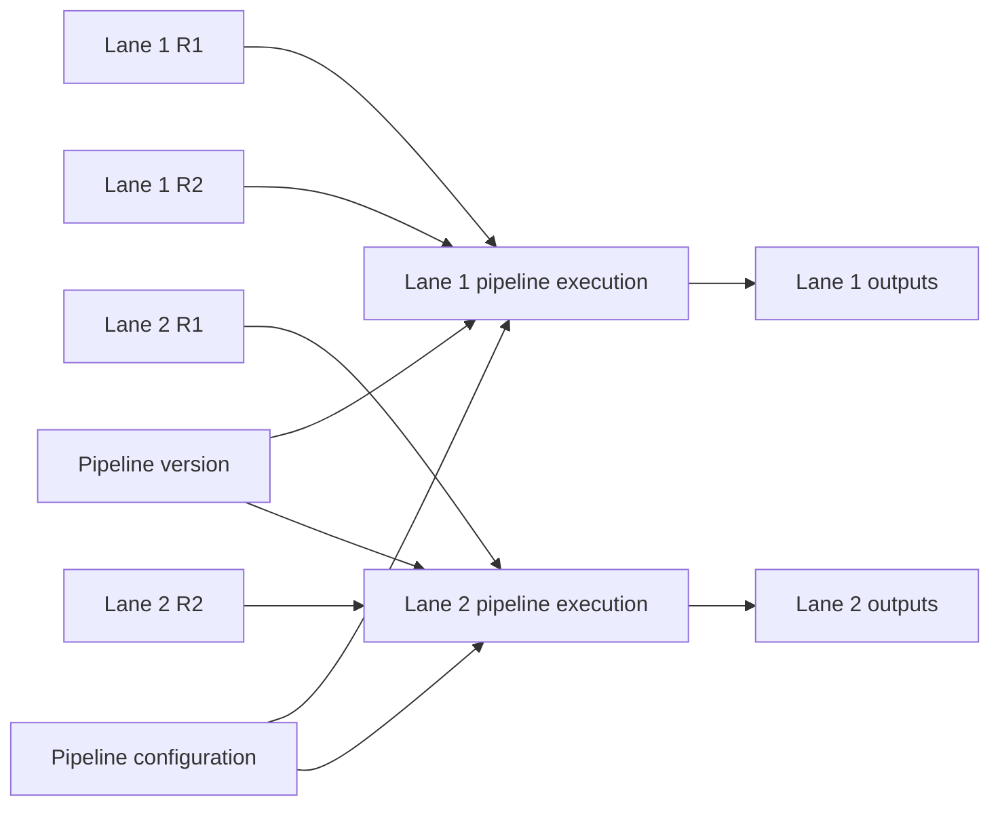

# Processing each lane independently

```mermaid
flowchart LR
    L1R1[Lane 1 R1]
    L1R2[Lane 1 R2]
    L2R1[Lane 2 R1]
    L2R2[Lane 2 R2]

    V[Pipeline version]
    C[Pipeline configuration]

    E1[Lane 1 pipeline execution]
    E2[Lane 2 pipeline execution]

    O1[Lane 1 outputs]
    O2[Lane 2 outputs]

    L1R1 --> E1
    L1R2 --> E1

    L2R1 --> E2
    L2R2 --> E2

    V --> E1
    C --> E1

    V --> E2
    C --> E2

    E1 --> O1
    E2 --> O2
```
