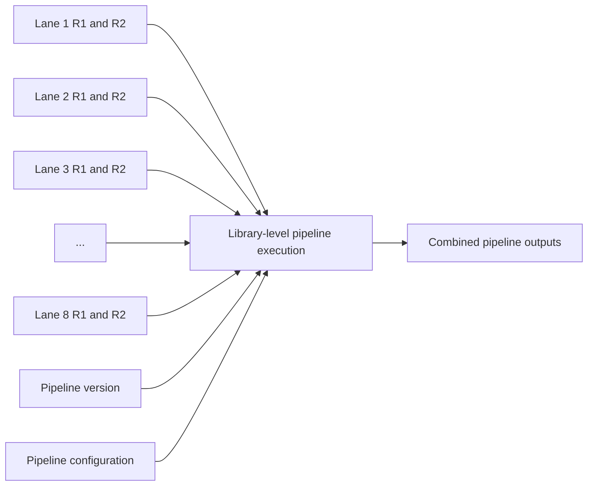

# Processing all lanes together

```mermaid
flowchart LR
    L1[Lane 1 R1 and R2]
    L2[Lane 2 R1 and R2]
    L3[Lane 3 R1 and R2]
    MORE[...]
    L8[Lane 8 R1 and R2]

    V[Pipeline version]
    C[Pipeline configuration]

    EXEC[Library-level pipeline execution]
    OUT[Combined pipeline outputs]

    L1 --> EXEC
    L2 --> EXEC
    L3 --> EXEC
    MORE --> EXEC
    L8 --> EXEC

    V --> EXEC
    C --> EXEC

    EXEC --> OUT
```
