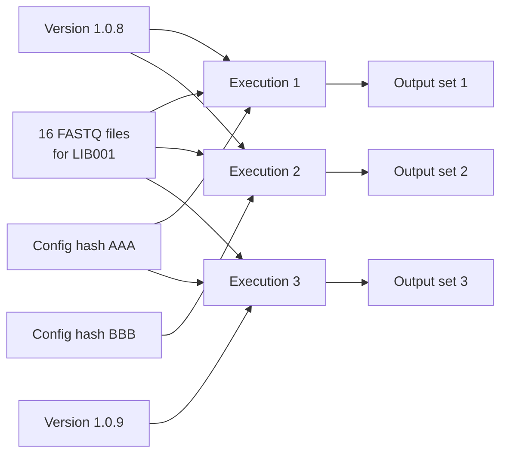

# Same FASTQ files processed multiple ways

```mermaid
flowchart LR
    FASTQ[16 FASTQ files<br/>for LIB001]

    V1[Version 1.0.8]
    V2[Version 1.0.9]

    C1[Config hash AAA]
    C2[Config hash BBB]

    E1[Execution 1]
    E2[Execution 2]
    E3[Execution 3]

    FASTQ --> E1
    FASTQ --> E2
    FASTQ --> E3

    V1 --> E1
    C1 --> E1

    V1 --> E2
    C2 --> E2

    V2 --> E3
    C1 --> E3

    E1 --> O1[Output set 1]
    E2 --> O2[Output set 2]
    E3 --> O3[Output set 3]
```
