# DNA lab workflow Mermaid models

# High-level sequencing model

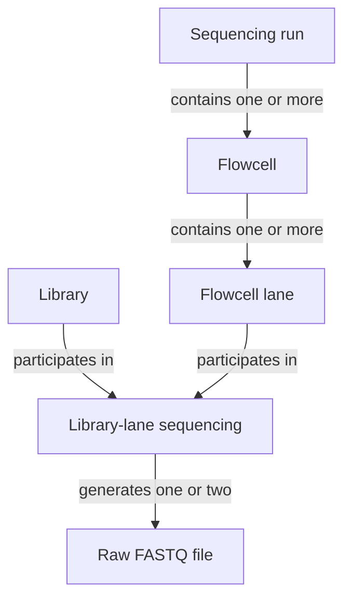

---

# Library-lane many-to-many relationship

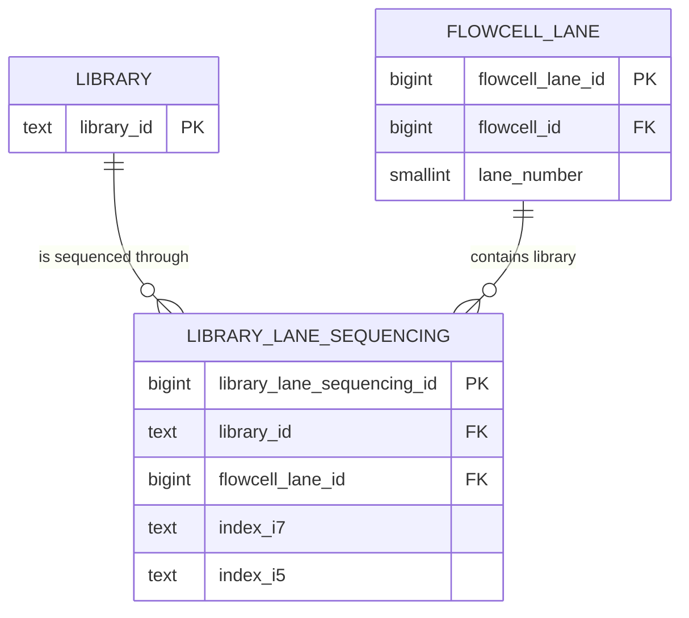

---

# Sequencing and raw FASTQ model

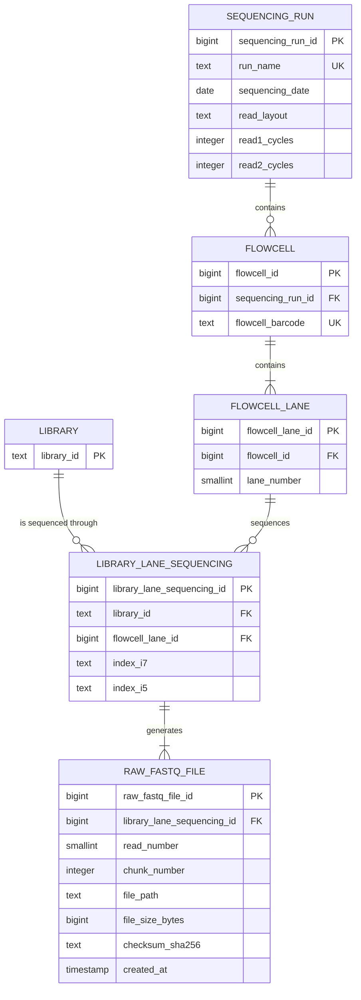

---

# FASTQ generation by sequencing method

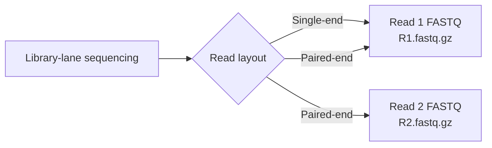

---

# Independent pipeline version and configuration model

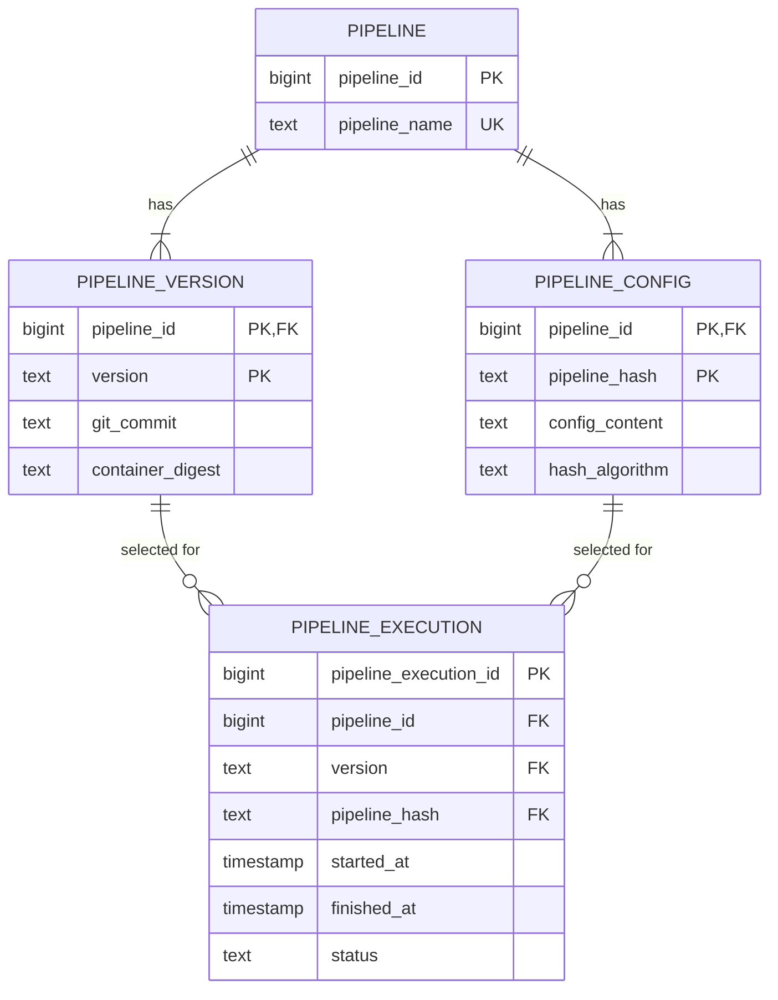

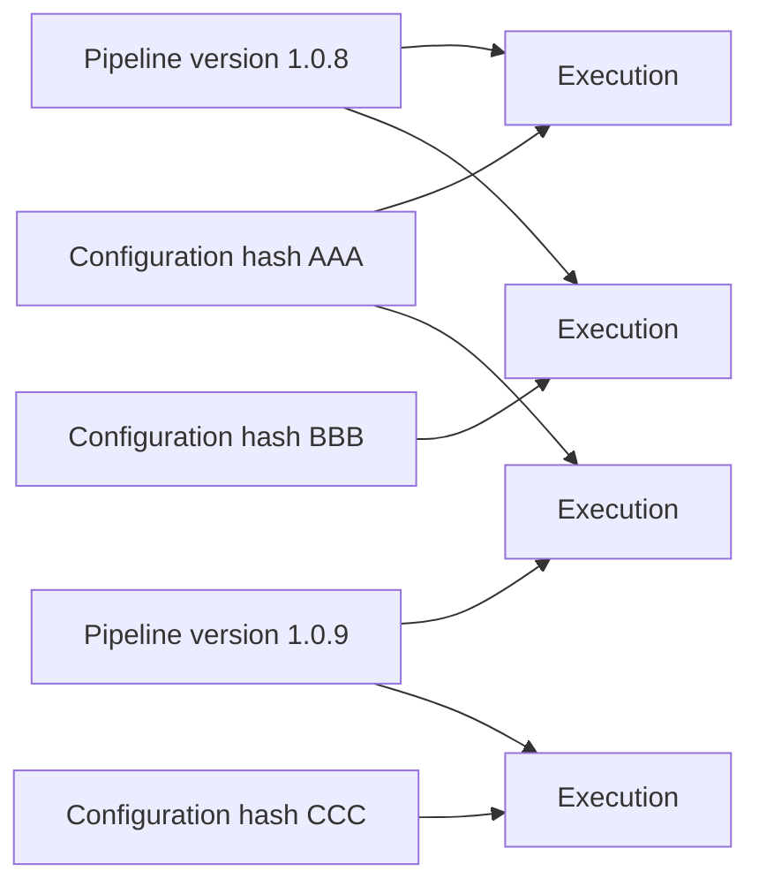

---

# Pipeline input many-to-many relationship

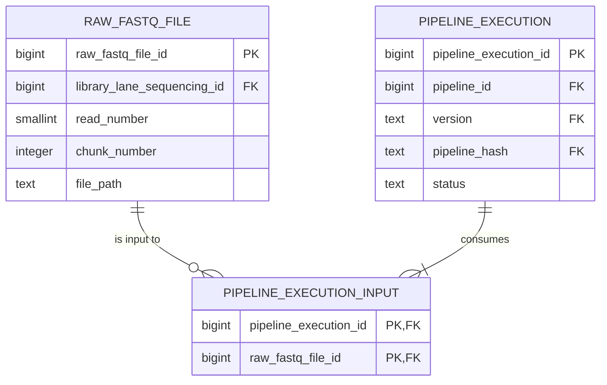

---

# Complete normalized entity-relationship model

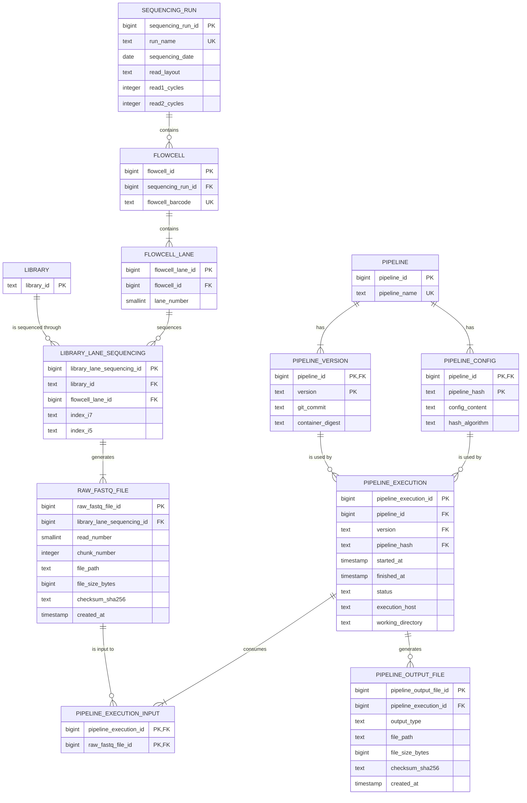

---

# Complete end-to-end data lineage

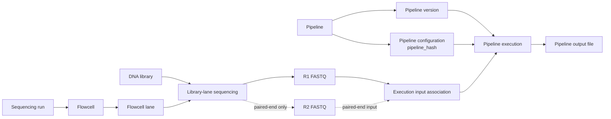

---

# Compact provenance model

---

# Paired-end library sequenced on eight lanes

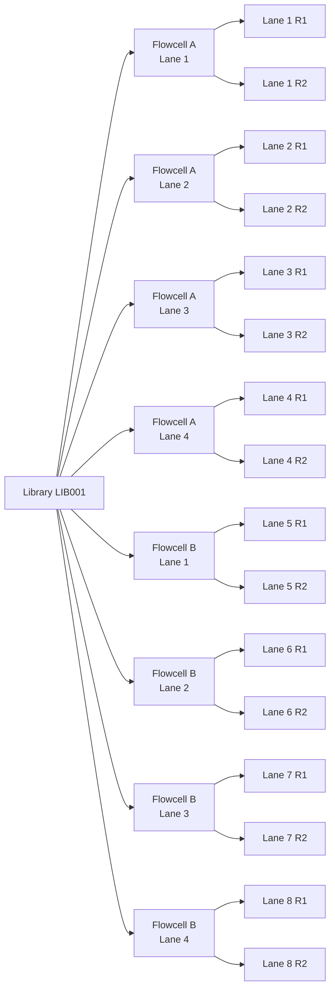

---

# Paired-end eight-lane file count

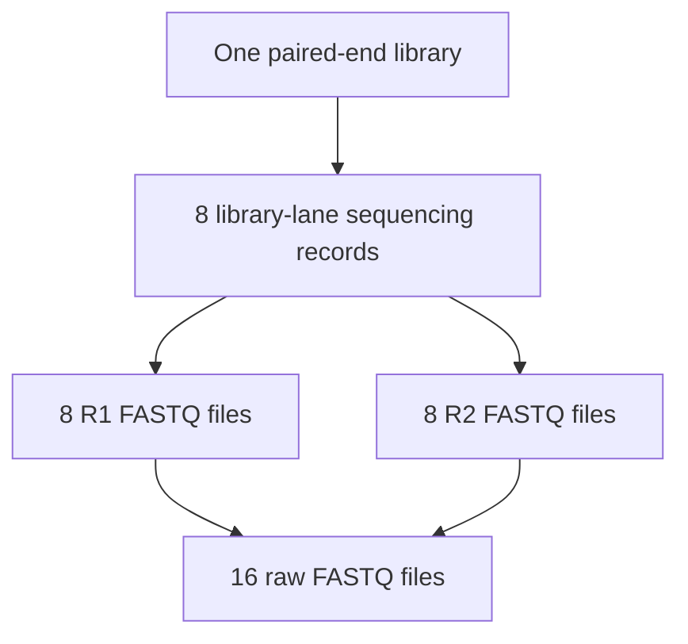

---

# Processing each lane independently

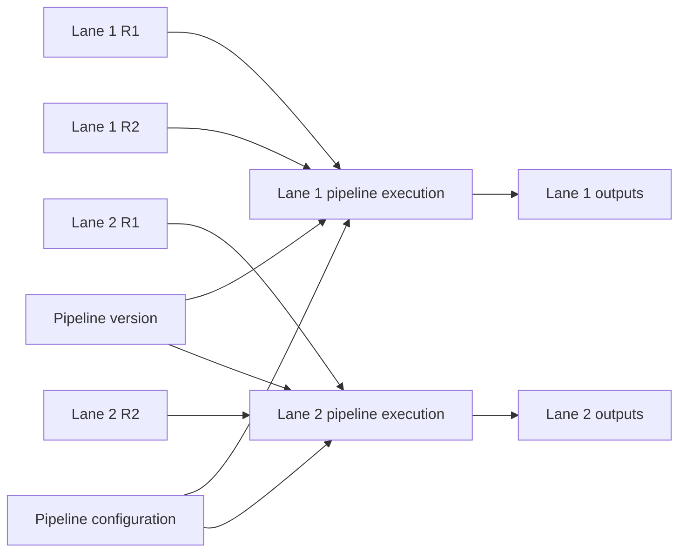

---

# Processing all lanes together

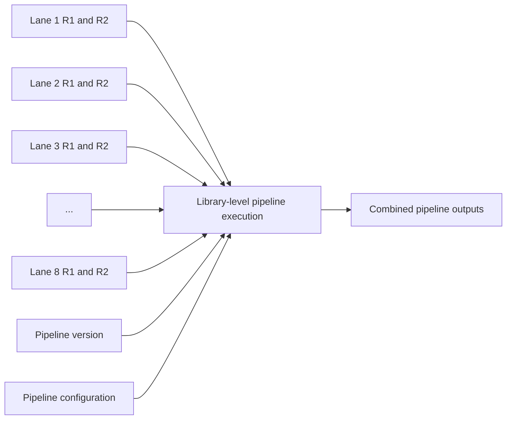

---

# Same FASTQ files processed multiple ways

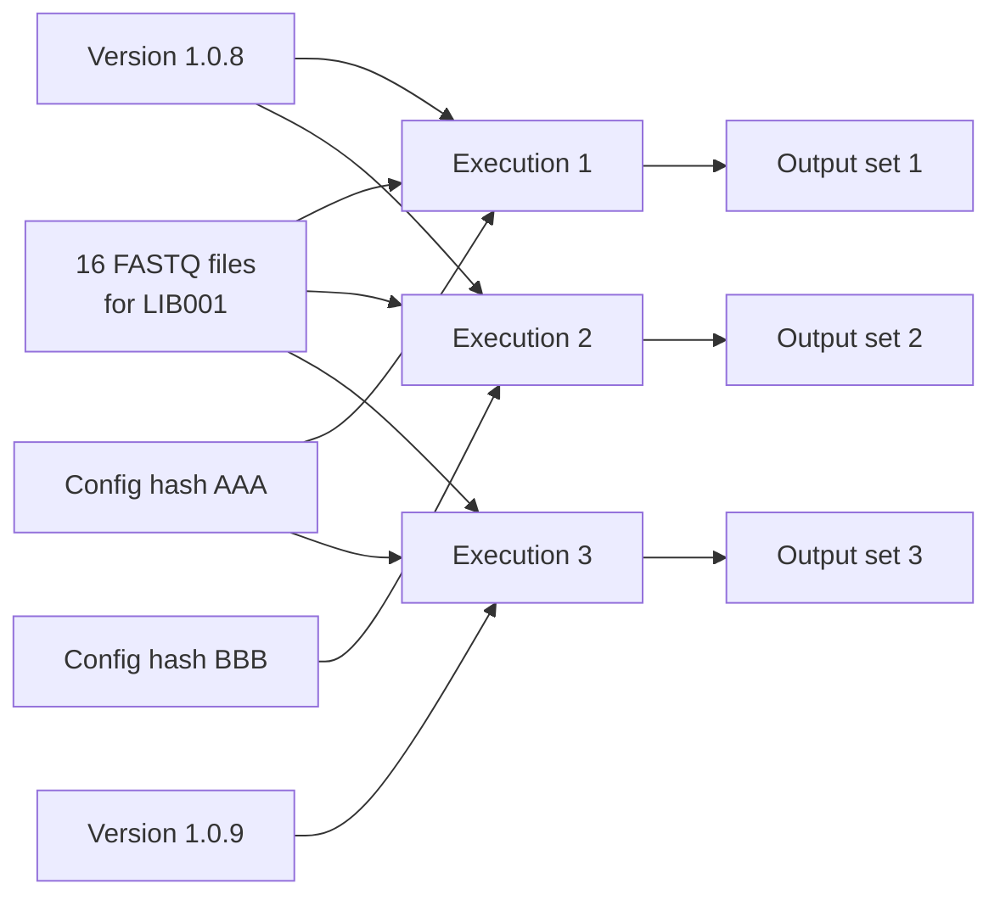

---
