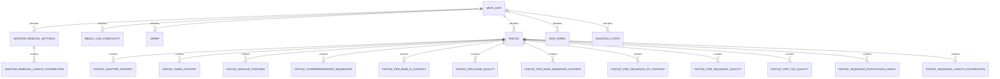

# Original database structure

```mermaid
erDiagram
    META_DATA ||--o{ ADAPTER_REMOVAL_SETTINGS : identifies
    META_DATA ||--o{ BBDUK_LOW_COMPLEXITY : identifies
    META_DATA o|--o{ DEREP : identifies
    META_DATA ||--o{ FASTQC : identifies
    META_DATA o|--o{ NON_PAREIL : identifies
    META_DATA ||--o{ SAMTOOLS_STATS : identifies

    ADAPTER_REMOVAL_SETTINGS ||--o{ ADAPTER_REMOVAL_LENGTH_DISTRIBUTION : contains

    FASTQC ||--o{ FASTQC_ADAPTER_CONTENT : contains
    FASTQC ||--o{ FASTQC_KMER_CONTENT : contains
    FASTQC ||--o{ FASTQC_MODULE_STATUSES : contains
    FASTQC ||--o{ FASTQC_OVERREPRESENTED_SEQUENCES : contains
    FASTQC ||--o{ FASTQC_PER_BASE_N_CONTENT : contains
    FASTQC ||--o{ FASTQC_PER_BASE_QUALITY : contains
    FASTQC ||--o{ FASTQC_PER_BASE_SEQUENCE_CONTENT : contains
    FASTQC ||--o{ FASTQC_PER_SEQUENCE_GC_CONTENT : contains
    FASTQC ||--o{ FASTQC_PER_SEQUENCE_QUALITY : contains
    FASTQC ||--o{ FASTQC_PER_TILE_QUALITY : contains
    FASTQC ||--o{ FASTQC_SEQUENCE_DUPLICATION_LEVELS : contains
    FASTQC ||--o{ FASTQC_SEQUENCE_LENGTH_DISTRIBUTION : contains
```

`AUDIT_LOG` is populated through triggers and therefore has no foreign-key relationship in this ER model.

