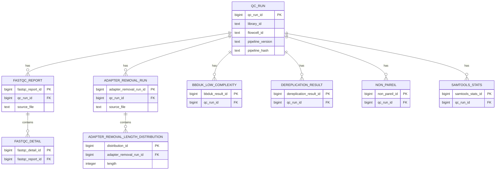

# Clearer naming with a central QC run

```mermaid
erDiagram
    QC_RUN {
        bigint qc_run_id PK
        text library_id
        text flowcell_id
        text pipeline_version
        text pipeline_hash
    }

    FASTQC_REPORT {
        bigint fastqc_report_id PK
        bigint qc_run_id FK
        text source_file
    }

    ADAPTER_REMOVAL_RUN {
        bigint adapter_removal_run_id PK
        bigint qc_run_id FK
        text source_file
    }

    ADAPTER_REMOVAL_LENGTH_DISTRIBUTION {
        bigint distribution_id PK
        bigint adapter_removal_run_id FK
        integer length
    }

    BBDUK_LOW_COMPLEXITY {
        bigint bbduk_result_id PK
        bigint qc_run_id FK
    }

    DEREPLICATION_RESULT {
        bigint dereplication_result_id PK
        bigint qc_run_id FK
    }

    NON_PAREIL {
        bigint non_pareil_id PK
        bigint qc_run_id FK
    }

    SAMTOOLS_STATS {
        bigint samtools_stats_id PK
        bigint qc_run_id FK
    }

    FASTQC_DETAIL {
        bigint fastqc_detail_id PK
        bigint fastqc_report_id FK
    }

    QC_RUN ||--o{ FASTQC_REPORT : has
    QC_RUN ||--o{ ADAPTER_REMOVAL_RUN : has
    QC_RUN ||--o{ BBDUK_LOW_COMPLEXITY : has
    QC_RUN ||--o{ DEREPLICATION_RESULT : has
    QC_RUN ||--o{ NON_PAREIL : has
    QC_RUN ||--o{ SAMTOOLS_STATS : has

    ADAPTER_REMOVAL_RUN ||--o{ ADAPTER_REMOVAL_LENGTH_DISTRIBUTION : contains
    FASTQC_REPORT ||--o{ FASTQC_DETAIL : contains
```

