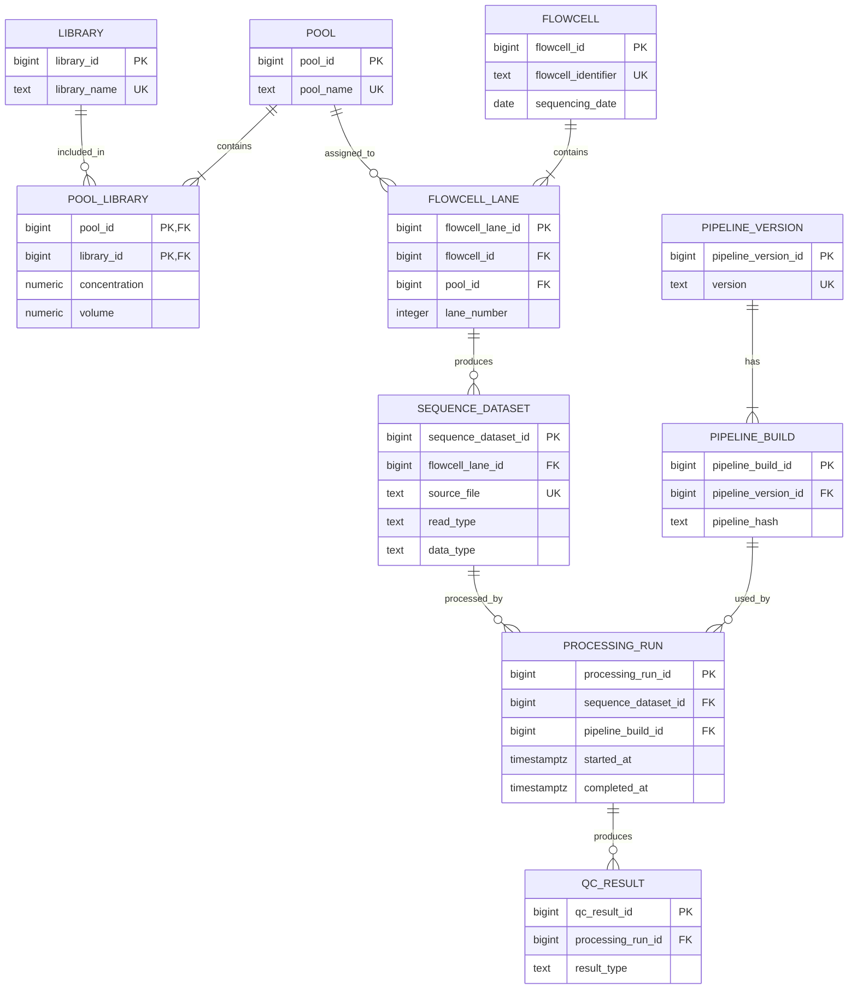

# Concrete laboratory and pipeline-build model

This initial model was superseded after clarifying that `pipeline_hash` identifies configuration rather than a software build.

```mermaid
erDiagram
    LIBRARY {
        bigint library_id PK
        text library_name UK
    }

    POOL {
        bigint pool_id PK
        text pool_name UK
    }

    POOL_LIBRARY {
        bigint pool_id PK, FK
        bigint library_id PK, FK
        numeric concentration
        numeric volume
    }

    FLOWCELL {
        bigint flowcell_id PK
        text flowcell_identifier UK
        date sequencing_date
    }

    FLOWCELL_LANE {
        bigint flowcell_lane_id PK
        bigint flowcell_id FK
        bigint pool_id FK
        integer lane_number
    }

    SEQUENCE_DATASET {
        bigint sequence_dataset_id PK
        bigint flowcell_lane_id FK
        text source_file UK
        text read_type
        text data_type
    }

    PIPELINE_VERSION {
        bigint pipeline_version_id PK
        text version UK
    }

    PIPELINE_BUILD {
        bigint pipeline_build_id PK
        bigint pipeline_version_id FK
        text pipeline_hash
    }

    PROCESSING_RUN {
        bigint processing_run_id PK
        bigint sequence_dataset_id FK
        bigint pipeline_build_id FK
        timestamptz started_at
        timestamptz completed_at
    }

    QC_RESULT {
        bigint qc_result_id PK
        bigint processing_run_id FK
        text result_type
    }

    LIBRARY ||--o{ POOL_LIBRARY : included_in
    POOL ||--|{ POOL_LIBRARY : contains
    FLOWCELL ||--|{ FLOWCELL_LANE : contains
    POOL ||--o{ FLOWCELL_LANE : assigned_to
    FLOWCELL_LANE ||--o{ SEQUENCE_DATASET : produces
    PIPELINE_VERSION ||--|{ PIPELINE_BUILD : has
    PIPELINE_BUILD ||--o{ PROCESSING_RUN : used_by
    SEQUENCE_DATASET ||--o{ PROCESSING_RUN : processed_by
    PROCESSING_RUN ||--o{ QC_RESULT : produces
```

