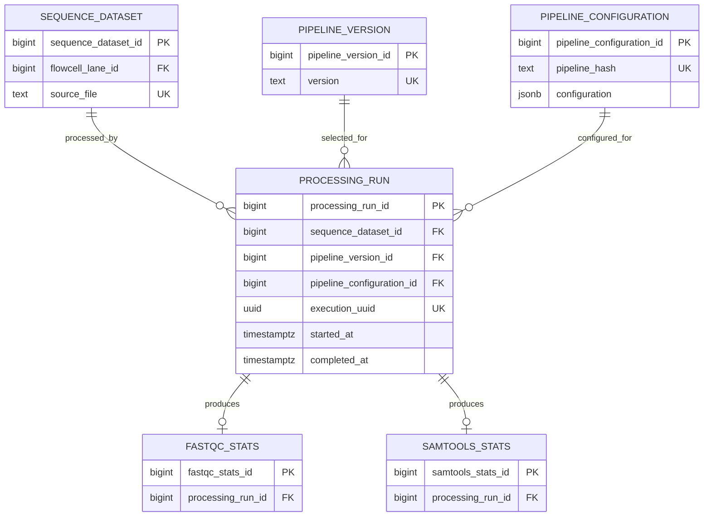
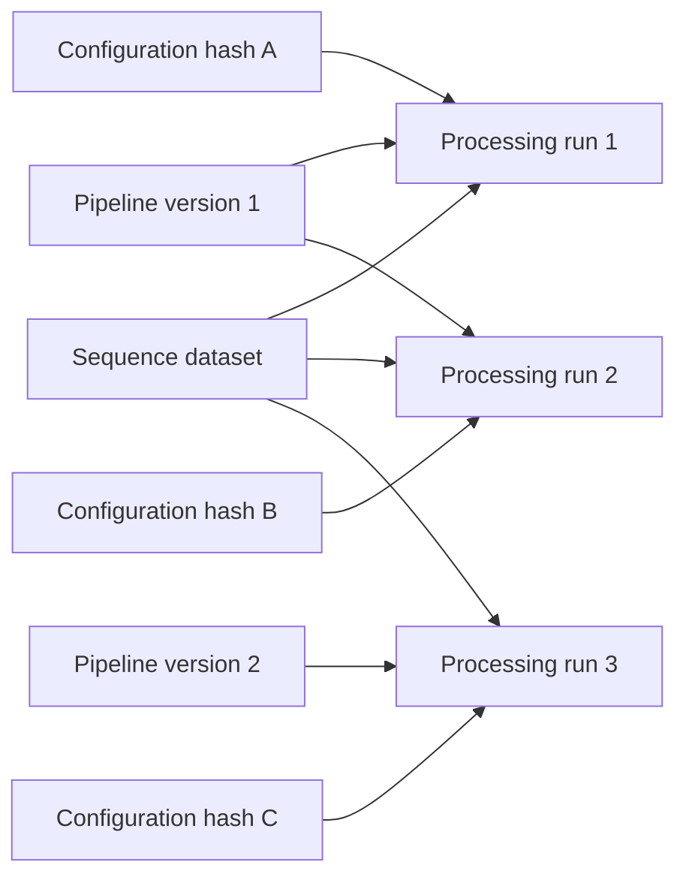

# Pipeline version and configuration model

Each processing run selects exactly one sequence dataset, one pipeline version, and one pipeline configuration.

```mermaid
erDiagram
    SEQUENCE_DATASET {
        bigint sequence_dataset_id PK
        bigint flowcell_lane_id FK
        text source_file UK
    }

    PIPELINE_VERSION {
        bigint pipeline_version_id PK
        text version UK
    }

    PIPELINE_CONFIGURATION {
        bigint pipeline_configuration_id PK
        text pipeline_hash UK
        jsonb configuration
    }

    PROCESSING_RUN {
        bigint processing_run_id PK
        bigint sequence_dataset_id FK
        bigint pipeline_version_id FK
        bigint pipeline_configuration_id FK
        uuid execution_uuid UK
        timestamptz started_at
        timestamptz completed_at
    }

    FASTQC_STATS {
        bigint fastqc_stats_id PK
        bigint processing_run_id FK
    }

    SAMTOOLS_STATS {
        bigint samtools_stats_id PK
        bigint processing_run_id FK
    }

    SEQUENCE_DATASET ||--o{ PROCESSING_RUN : processed_by
    PIPELINE_VERSION ||--o{ PROCESSING_RUN : selected_for
    PIPELINE_CONFIGURATION ||--o{ PROCESSING_RUN : configured_for
    PROCESSING_RUN ||--o| FASTQC_STATS : produces
    PROCESSING_RUN ||--o| SAMTOOLS_STATS : produces
```

```mermaid
flowchart LR
    S["Sequence dataset"]
    V1["Pipeline version 1"]
    V2["Pipeline version 2"]
    C1["Configuration hash A"]
    C2["Configuration hash B"]
    C3["Configuration hash C"]
    R1["Processing run 1"]
    R2["Processing run 2"]
    R3["Processing run 3"]

    S --> R1
    S --> R2
    S --> R3
    V1 --> R1
    V1 --> R2
    V2 --> R3
    C1 --> R1
    C2 --> R2
    C3 --> R3
```

