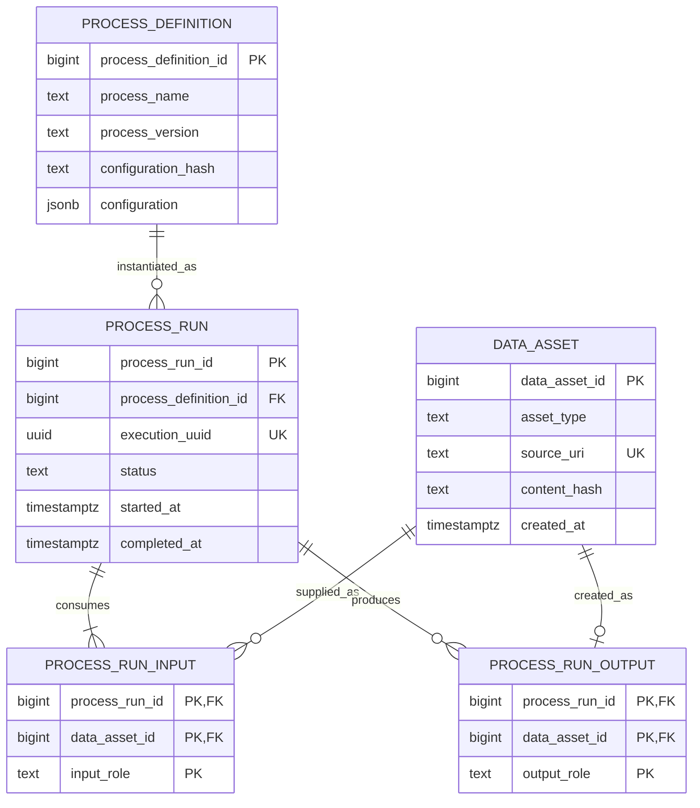

# Abstract process-definition model

```mermaid
erDiagram
    DATA_ASSET {
        bigint data_asset_id PK
        text asset_type
        text source_uri UK
        text content_hash
        timestamptz created_at
    }

    PROCESS_DEFINITION {
        bigint process_definition_id PK
        text process_name
        text process_version
        text configuration_hash
        jsonb configuration
    }

    PROCESS_RUN {
        bigint process_run_id PK
        bigint process_definition_id FK
        uuid execution_uuid UK
        text status
        timestamptz started_at
        timestamptz completed_at
    }

    PROCESS_RUN_INPUT {
        bigint process_run_id PK, FK
        bigint data_asset_id PK, FK
        text input_role PK
    }

    PROCESS_RUN_OUTPUT {
        bigint process_run_id PK, FK
        bigint data_asset_id PK, FK
        text output_role PK
    }

    PROCESS_DEFINITION ||--o{ PROCESS_RUN : instantiated_as
    PROCESS_RUN ||--|{ PROCESS_RUN_INPUT : consumes
    DATA_ASSET ||--o{ PROCESS_RUN_INPUT : supplied_as
    PROCESS_RUN ||--o{ PROCESS_RUN_OUTPUT : produces
    DATA_ASSET ||--o| PROCESS_RUN_OUTPUT : created_as
```

