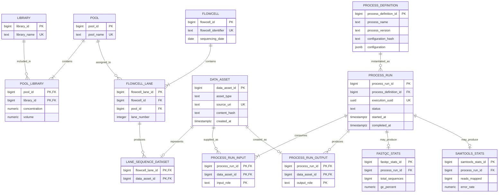

# Complete abstract laboratory and provenance model

```mermaid
erDiagram
    LIBRARY {
        bigint library_id PK
        text library_name UK
    }

    POOL {
        bigint pool_id PK
        text pool_name UK
    }

    POOL_LIBRARY {
        bigint pool_id PK, FK
        bigint library_id PK, FK
        numeric concentration
        numeric volume
    }

    FLOWCELL {
        bigint flowcell_id PK
        text flowcell_identifier UK
        date sequencing_date
    }

    FLOWCELL_LANE {
        bigint flowcell_lane_id PK
        bigint flowcell_id FK
        bigint pool_id FK
        integer lane_number
    }

    DATA_ASSET {
        bigint data_asset_id PK
        text asset_type
        text source_uri UK
        text content_hash
        timestamptz created_at
    }

    LANE_SEQUENCE_DATASET {
        bigint flowcell_lane_id PK, FK
        bigint data_asset_id PK, FK
    }

    PROCESS_DEFINITION {
        bigint process_definition_id PK
        text process_name
        text process_version
        text configuration_hash
        jsonb configuration
    }

    PROCESS_RUN {
        bigint process_run_id PK
        bigint process_definition_id FK
        uuid execution_uuid UK
        text status
        timestamptz started_at
        timestamptz completed_at
    }

    PROCESS_RUN_INPUT {
        bigint process_run_id PK, FK
        bigint data_asset_id PK, FK
        text input_role PK
    }

    PROCESS_RUN_OUTPUT {
        bigint process_run_id PK, FK
        bigint data_asset_id PK, FK
        text output_role PK
    }

    FASTQC_STATS {
        bigint fastqc_stats_id PK
        bigint process_run_id FK
        bigint total_sequences
        numeric gc_percent
    }

    SAMTOOLS_STATS {
        bigint samtools_stats_id PK
        bigint process_run_id FK
        bigint reads_mapped
        numeric error_rate
    }

    LIBRARY ||--o{ POOL_LIBRARY : included_in
    POOL ||--|{ POOL_LIBRARY : contains
    FLOWCELL ||--|{ FLOWCELL_LANE : contains
    POOL ||--o{ FLOWCELL_LANE : assigned_to
    FLOWCELL_LANE ||--o{ LANE_SEQUENCE_DATASET : produces
    DATA_ASSET ||--o| LANE_SEQUENCE_DATASET : represents
    PROCESS_DEFINITION ||--o{ PROCESS_RUN : instantiated_as
    PROCESS_RUN ||--|{ PROCESS_RUN_INPUT : consumes
    DATA_ASSET ||--o{ PROCESS_RUN_INPUT : supplied_as
    PROCESS_RUN ||--o{ PROCESS_RUN_OUTPUT : produces
    DATA_ASSET ||--o| PROCESS_RUN_OUTPUT : created_as
    PROCESS_RUN ||--o| FASTQC_STATS : may_produce
    PROCESS_RUN ||--o| SAMTOOLS_STATS : may_produce
```

