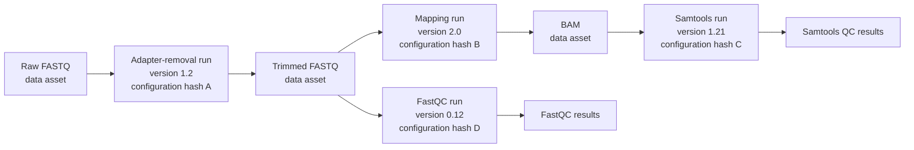

# Example processing-provenance graph

```mermaid
flowchart LR
    RAW["Raw FASTQ<br/>data asset"]
    AR["Adapter-removal run<br/>version 1.2<br/>configuration hash A"]
    TRIMMED["Trimmed FASTQ<br/>data asset"]
    MAP["Mapping run<br/>version 2.0<br/>configuration hash B"]
    BAM["BAM<br/>data asset"]
    SAM["Samtools run<br/>version 1.21<br/>configuration hash C"]
    SAMQC["Samtools QC results"]
    FQC["FastQC run<br/>version 0.12<br/>configuration hash D"]
    FQC_RESULT["FastQC results"]

    RAW --> AR
    AR --> TRIMMED
    TRIMMED --> MAP
    MAP --> BAM
    BAM --> SAM
    SAM --> SAMQC
    TRIMMED --> FQC
    FQC --> FQC_RESULT
```

