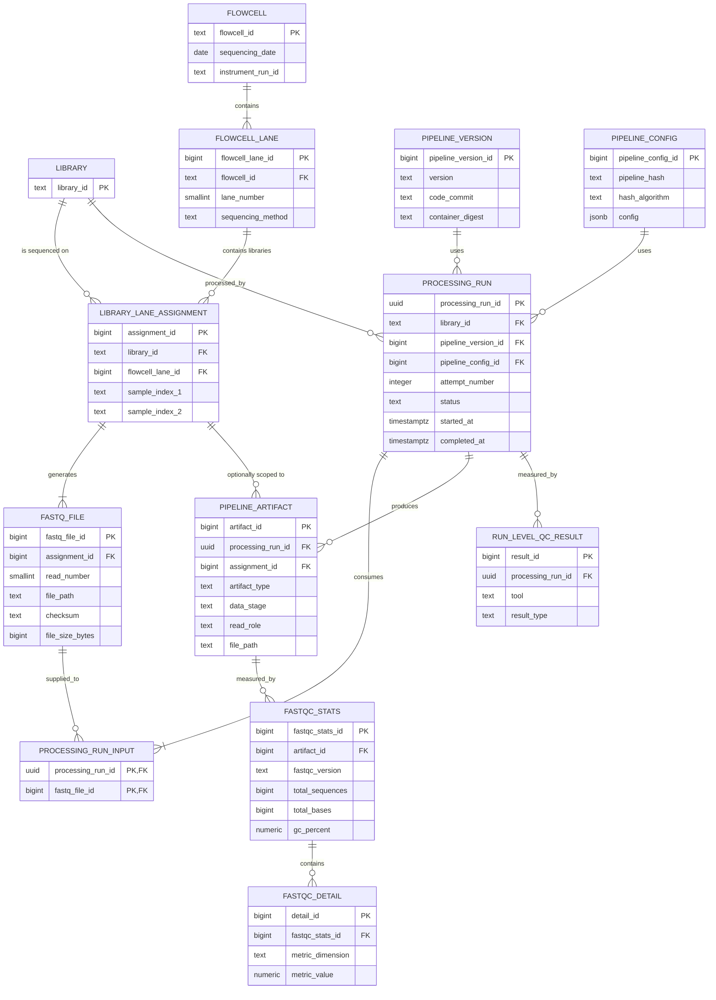

# Initial suggested model

This was the initial model separating physical sequencing, files, pipeline
executions, and QC results.

```mermaid
erDiagram
    LIBRARY {
        text library_id PK
    }

    FLOWCELL {
        text flowcell_id PK
        date sequencing_date
        text instrument_run_id
    }

    FLOWCELL_LANE {
        bigint flowcell_lane_id PK
        text flowcell_id FK
        smallint lane_number
        text sequencing_method
    }

    LIBRARY_LANE_ASSIGNMENT {
        bigint assignment_id PK
        text library_id FK
        bigint flowcell_lane_id FK
        text sample_index_1
        text sample_index_2
    }

    FASTQ_FILE {
        bigint fastq_file_id PK
        bigint assignment_id FK
        smallint read_number
        text file_path
        text checksum
        bigint file_size_bytes
    }

    PIPELINE_VERSION {
        bigint pipeline_version_id PK
        text version
        text code_commit
        text container_digest
    }

    PIPELINE_CONFIG {
        bigint pipeline_config_id PK
        text pipeline_hash
        text hash_algorithm
        jsonb config
    }

    PROCESSING_RUN {
        uuid processing_run_id PK
        text library_id FK
        bigint pipeline_version_id FK
        bigint pipeline_config_id FK
        integer attempt_number
        text status
        timestamptz started_at
        timestamptz completed_at
    }

    PROCESSING_RUN_INPUT {
        uuid processing_run_id PK,FK
        bigint fastq_file_id PK,FK
    }

    PIPELINE_ARTIFACT {
        bigint artifact_id PK
        uuid processing_run_id FK
        bigint assignment_id FK
        text artifact_type
        text data_stage
        text read_role
        text file_path
    }

    FASTQC_STATS {
        bigint fastqc_stats_id PK
        bigint artifact_id FK
        text fastqc_version
        bigint total_sequences
        bigint total_bases
        numeric gc_percent
    }

    FASTQC_DETAIL {
        bigint detail_id PK
        bigint fastqc_stats_id FK
        text metric_dimension
        numeric metric_value
    }

    RUN_LEVEL_QC_RESULT {
        bigint result_id PK
        uuid processing_run_id FK
        text tool
        text result_type
    }

    LIBRARY ||--o{ LIBRARY_LANE_ASSIGNMENT : "is sequenced on"
    FLOWCELL ||--|{ FLOWCELL_LANE : contains
    FLOWCELL_LANE ||--o{ LIBRARY_LANE_ASSIGNMENT : "contains libraries"

    LIBRARY_LANE_ASSIGNMENT ||--|{ FASTQ_FILE : generates

    LIBRARY ||--o{ PROCESSING_RUN : processed_by
    PIPELINE_VERSION ||--o{ PROCESSING_RUN : uses
    PIPELINE_CONFIG ||--o{ PROCESSING_RUN : uses

    PROCESSING_RUN ||--|{ PROCESSING_RUN_INPUT : consumes
    FASTQ_FILE ||--o{ PROCESSING_RUN_INPUT : supplied_to

    PROCESSING_RUN ||--o{ PIPELINE_ARTIFACT : produces
    LIBRARY_LANE_ASSIGNMENT ||--o{ PIPELINE_ARTIFACT : "optionally scoped to"

    PIPELINE_ARTIFACT ||--o{ FASTQC_STATS : measured_by
    FASTQC_STATS ||--o{ FASTQC_DETAIL : contains

    PROCESSING_RUN ||--o{ RUN_LEVEL_QC_RESULT : measured_by
```

