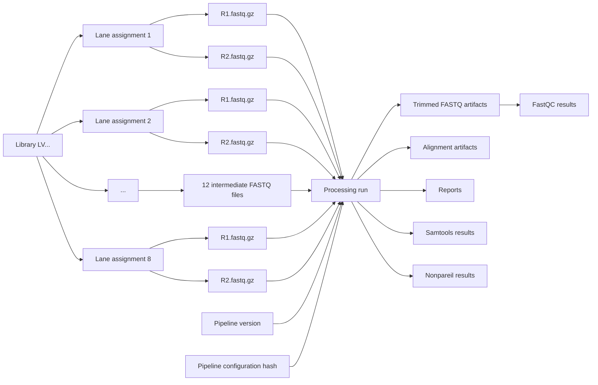

# Eight-lane paired-end example

```mermaid
flowchart LR
    L[Library LV...] --> A1[Lane assignment 1]
    L --> A2[Lane assignment 2]
    L --> AX[...]
    L --> A8[Lane assignment 8]

    A1 --> R1A[R1.fastq.gz]
    A1 --> R2A[R2.fastq.gz]

    A2 --> R1B[R1.fastq.gz]
    A2 --> R2B[R2.fastq.gz]

    AX --> RX[12 intermediate FASTQ files]

    A8 --> R1H[R1.fastq.gz]
    A8 --> R2H[R2.fastq.gz]

    R1A & R2A & R1B & R2B & RX & R1H & R2H --> PR[Processing run]

    PV[Pipeline version] --> PR
    PC[Pipeline configuration hash] --> PR

    PR --> O1[Trimmed FASTQ artifacts]
    PR --> O2[Alignment artifacts]
    PR --> O3[Reports]

    O1 --> FQ[FastQC results]
    PR --> ST[Samtools results]
    PR --> NP[Nonpareil results]
```

