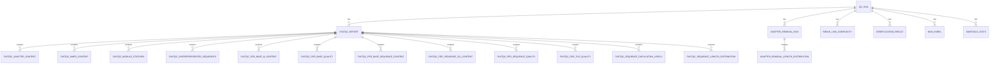

# 2. Simplified normalized QC model

This model replaces the repeated metadata composite key with a central `QC_RUN`.

```mermaid
erDiagram
    QC_RUN ||--o{ FASTQC_REPORT : has
    QC_RUN ||--o{ ADAPTER_REMOVAL_RUN : has
    QC_RUN ||--o{ BBDUK_LOW_COMPLEXITY : has
    QC_RUN ||--o{ DEREPLICATION_RESULT : has
    QC_RUN ||--o{ NON_PAREIL : has
    QC_RUN ||--o{ SAMTOOLS_STATS : has

    ADAPTER_REMOVAL_RUN ||--o{ ADAPTER_REMOVAL_LENGTH_DISTRIBUTION : contains

    FASTQC_REPORT ||--o{ FASTQC_ADAPTER_CONTENT : contains
    FASTQC_REPORT ||--o{ FASTQC_KMER_CONTENT : contains
    FASTQC_REPORT ||--o{ FASTQC_MODULE_STATUSES : contains
    FASTQC_REPORT ||--o{ FASTQC_OVERREPRESENTED_SEQUENCES : contains
    FASTQC_REPORT ||--o{ FASTQC_PER_BASE_N_CONTENT : contains
    FASTQC_REPORT ||--o{ FASTQC_PER_BASE_QUALITY : contains
    FASTQC_REPORT ||--o{ FASTQC_PER_BASE_SEQUENCE_CONTENT : contains
    FASTQC_REPORT ||--o{ FASTQC_PER_SEQUENCE_GC_CONTENT : contains
    FASTQC_REPORT ||--o{ FASTQC_PER_SEQUENCE_QUALITY : contains
    FASTQC_REPORT ||--o{ FASTQC_PER_TILE_QUALITY : contains
    FASTQC_REPORT ||--o{ FASTQC_SEQUENCE_DUPLICATION_LEVELS : contains
    FASTQC_REPORT ||--o{ FASTQC_SEQUENCE_LENGTH_DISTRIBUTION : contains
```

