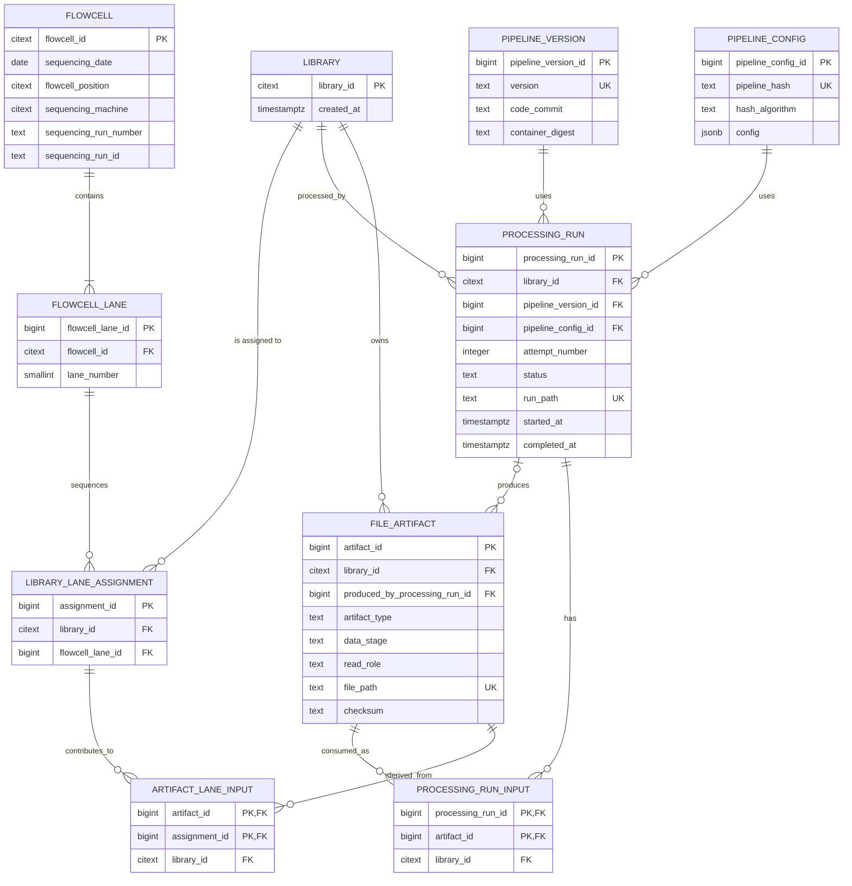

# Current `uploaded_data_next` and proposed `qc_next` model

This diagram represents the populated `uploaded_data_next` schema and the
core `qc_next` model proposed in `sql/003_create_qc_next_core.sql`.

