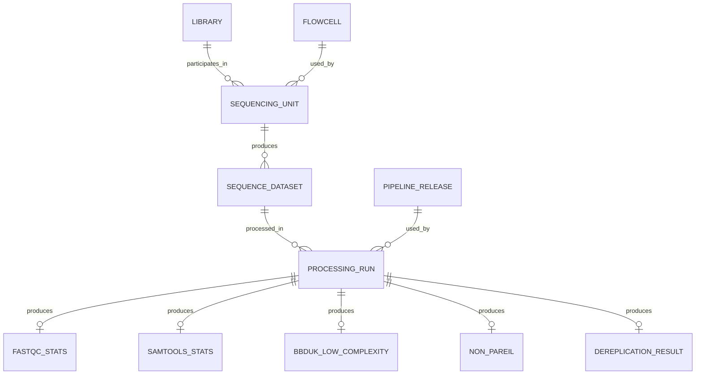

# 3. Initial sequencing and processing model

This version models the many-to-many relationship between libraries and flowcells before pooling was introduced. It was superseded by the pool and lane model.

