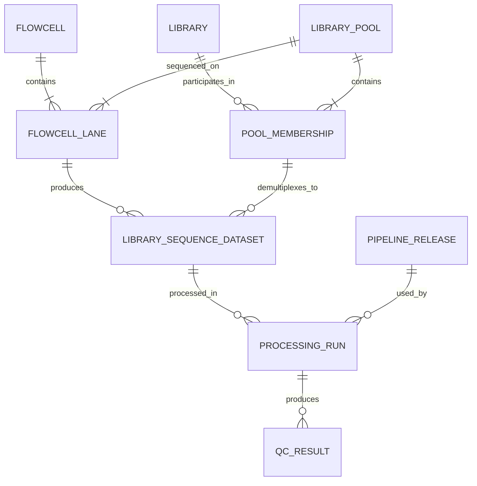
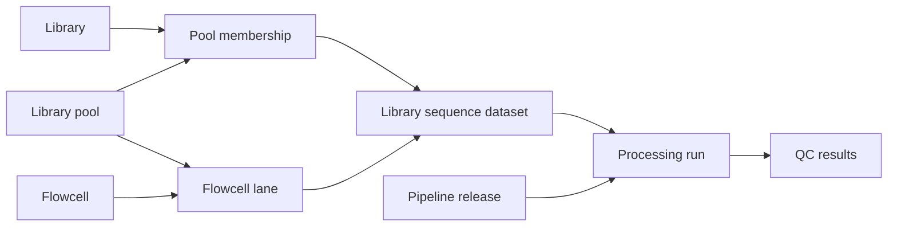

# 4. Pool and flowcell-lane model

This version adds library pools and the rule that each lane sequences exactly one pool.

```mermaid
erDiagram
    LIBRARY ||--o{ POOL_MEMBERSHIP : participates_in
    LIBRARY_POOL ||--|{ POOL_MEMBERSHIP : contains

    FLOWCELL ||--|{ FLOWCELL_LANE : contains
    LIBRARY_POOL ||--|{ FLOWCELL_LANE : sequenced_on

    FLOWCELL_LANE ||--o{ LIBRARY_SEQUENCE_DATASET : produces
    POOL_MEMBERSHIP ||--o{ LIBRARY_SEQUENCE_DATASET : demultiplexes_to

    LIBRARY_SEQUENCE_DATASET ||--o{ PROCESSING_RUN : processed_in
    PIPELINE_RELEASE ||--o{ PROCESSING_RUN : used_by

    PROCESSING_RUN ||--o{ QC_RESULT : produces
```

```mermaid
flowchart LR
    L["Library"] --> PM["Pool membership"]
    P["Library pool"] --> PM

    P --> FL["Flowcell lane"]
    F["Flowcell"] --> FL

    PM --> D["Library sequence dataset"]
    FL --> D

    D --> PR["Processing run"]
    PL["Pipeline release"] --> PR

    PR --> QC["QC results"]
```

