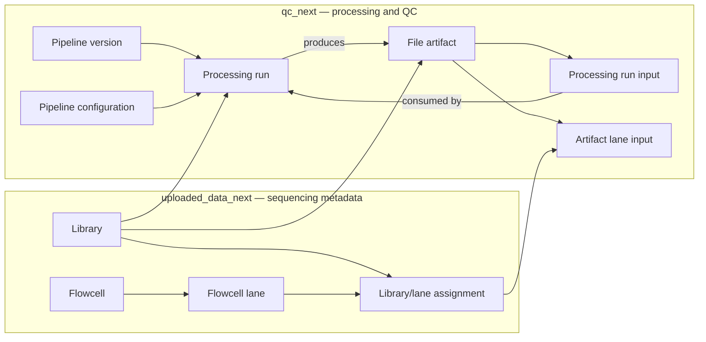

# Schema ownership

```mermaid
flowchart LR
    subgraph UD["uploaded_data_next — sequencing metadata"]
        L[Library]
        F[Flowcell]
        FL[Flowcell lane]
        A[Library/lane assignment]

        F --> FL
        L --> A
        FL --> A
    end

    subgraph QC["qc_next — processing and QC"]
        V[Pipeline version]
        C[Pipeline configuration]
        R[Processing run]
        X[File artifact]
        RI[Processing run input]
        AL[Artifact lane input]

        V --> R
        C --> R
        R -->|produces| X
        X --> RI
        RI -->|consumed by| R
        X --> AL
    end

    L --> R
    L --> X
    A --> AL
```

