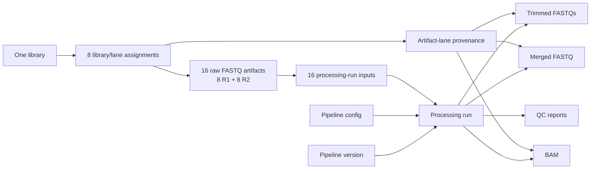

# Eight-lane artifact flow

```mermaid
flowchart LR
    L[One library] --> A[8 library/lane assignments]
    A --> F[16 raw FASTQ artifacts<br/>8 R1 + 8 R2]
    F --> I[16 processing-run inputs]

    V[Pipeline version] --> R[Processing run]
    C[Pipeline config] --> R
    I --> R

    R --> T[Trimmed FASTQs]
    R --> M[Merged FASTQ]
    R --> B[BAM]
    R --> Q[QC reports]

    A --> P[Artifact-lane provenance]
    P --> T
    P --> M
    P --> B
```

