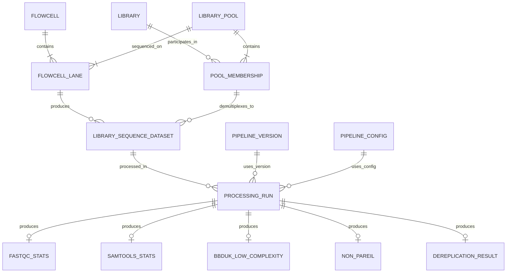
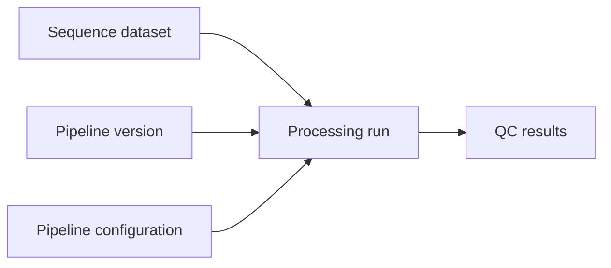

# 5. Independent pipeline version and configuration model

This model treats pipeline version and pipeline configuration as independent dimensions of a processing run. This is the recommended implementation-oriented model.





Conceptually:

```text
Processing run =
    Sequence dataset
    × Pipeline version
    × Pipeline configuration
```

