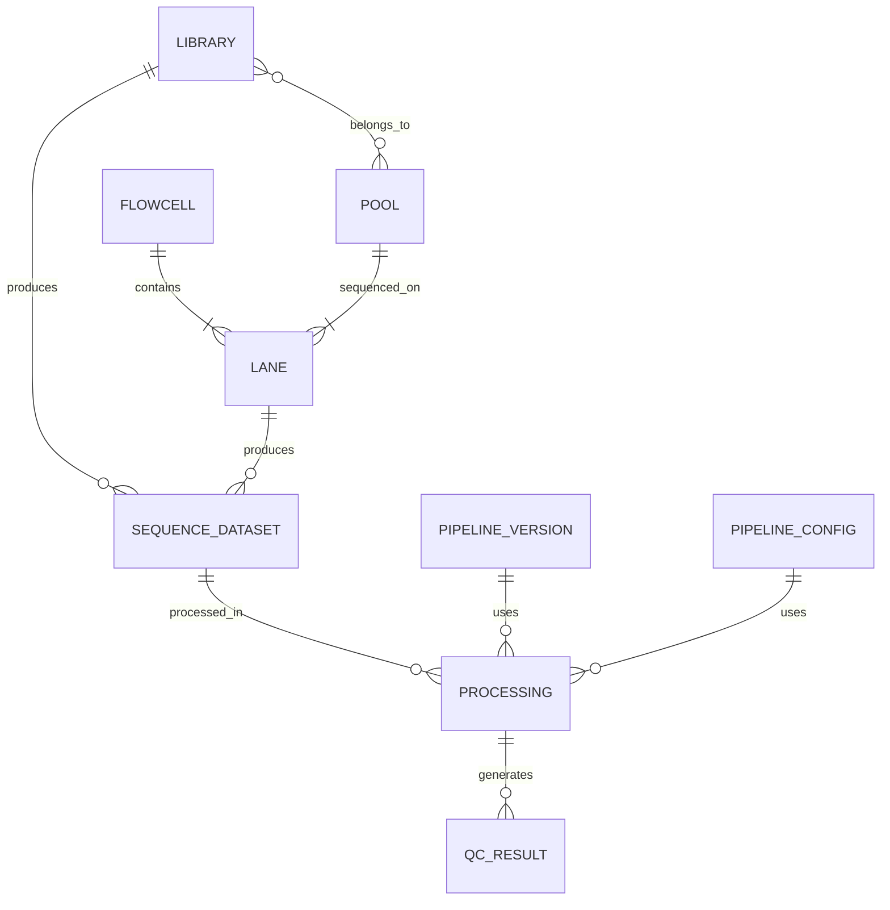
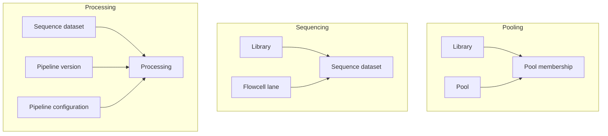

# 6. Final abstract domain model

This is the recommended conceptual model. It omits junction-table implementation details and focuses on domain relationships.

The three essential associative relationships are:

