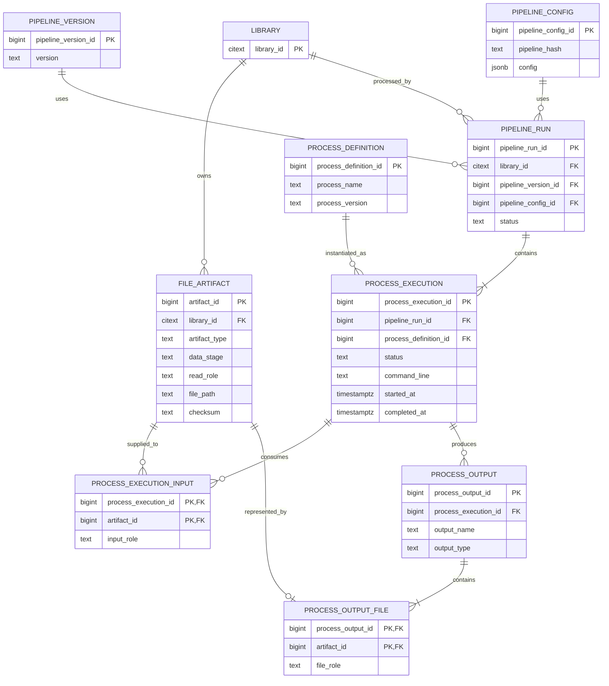

# Process-centric data model

This revision distinguishes an overall pipeline run from each individual
bioinformatic process execution.

```mermaid
erDiagram
    LIBRARY {
        citext library_id PK
    }

    FILE_ARTIFACT {
        bigint artifact_id PK
        citext library_id FK
        text artifact_type
        text data_stage
        text read_role
        text file_path
        text checksum
    }

    PIPELINE_VERSION {
        bigint pipeline_version_id PK
        text version
    }

    PIPELINE_CONFIG {
        bigint pipeline_config_id PK
        text pipeline_hash
        jsonb config
    }

    PIPELINE_RUN {
        bigint pipeline_run_id PK
        citext library_id FK
        bigint pipeline_version_id FK
        bigint pipeline_config_id FK
        text status
    }

    PROCESS_DEFINITION {
        bigint process_definition_id PK
        text process_name
        text process_version
    }

    PROCESS_EXECUTION {
        bigint process_execution_id PK
        bigint pipeline_run_id FK
        bigint process_definition_id FK
        text status
        text command_line
        timestamptz started_at
        timestamptz completed_at
    }

    PROCESS_EXECUTION_INPUT {
        bigint process_execution_id PK,FK
        bigint artifact_id PK,FK
        text input_role
    }

    PROCESS_OUTPUT {
        bigint process_output_id PK
        bigint process_execution_id FK
        text output_name
        text output_type
    }

    PROCESS_OUTPUT_FILE {
        bigint process_output_id PK,FK
        bigint artifact_id PK,FK
        text file_role
    }

    LIBRARY ||--o{ FILE_ARTIFACT : owns
    LIBRARY ||--o{ PIPELINE_RUN : processed_by

    PIPELINE_VERSION ||--o{ PIPELINE_RUN : uses
    PIPELINE_CONFIG ||--o{ PIPELINE_RUN : uses

    PIPELINE_RUN ||--|{ PROCESS_EXECUTION : contains
    PROCESS_DEFINITION ||--o{ PROCESS_EXECUTION : instantiated_as

    PROCESS_EXECUTION ||--o{ PROCESS_EXECUTION_INPUT : consumes
    FILE_ARTIFACT ||--o{ PROCESS_EXECUTION_INPUT : supplied_to

    PROCESS_EXECUTION ||--o{ PROCESS_OUTPUT : produces
    PROCESS_OUTPUT ||--|{ PROCESS_OUTPUT_FILE : contains
    FILE_ARTIFACT ||--o| PROCESS_OUTPUT_FILE : represented_by
```

