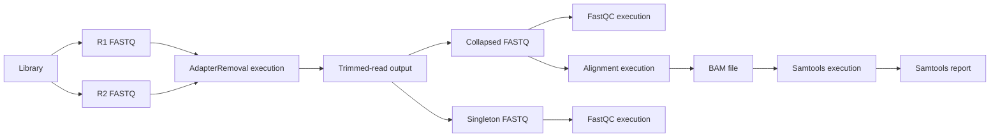

# Process lineage example

```mermaid
flowchart LR
    L[Library] --> R1[R1 FASTQ]
    L --> R2[R2 FASTQ]

    R1 --> AR[AdapterRemoval execution]
    R2 --> AR

    AR --> O1[Trimmed-read output]
    O1 --> C[Collapsed FASTQ]
    O1 --> S[Singleton FASTQ]

    C --> FQ1[FastQC execution]
    S --> FQ2[FastQC execution]

    C --> AL[Alignment execution]
    AL --> BAM[BAM file]

    BAM --> ST[Samtools execution]
    ST --> REPORT[Samtools report]
```

