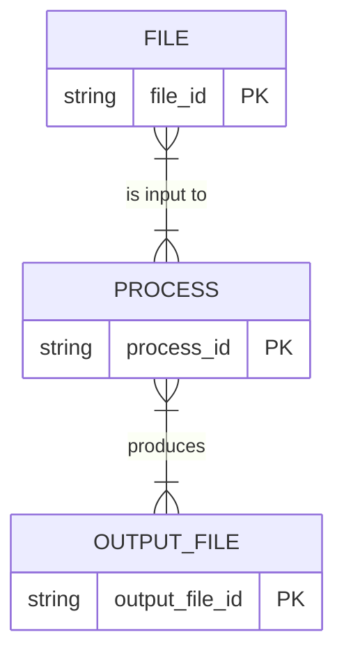

# File, process, and output file — conceptual model

```mermaid
erDiagram
    FILE }|--|{ PROCESS : "is input to"
    PROCESS }|--|{ OUTPUT_FILE : "produces"

    FILE {
        string file_id PK
    }

    PROCESS {
        string process_id PK
    }

    OUTPUT_FILE {
        string output_file_id PK
    }
```

Interpretation: mandatory many-to-many relationships between files and processes, and between processes and output files.
