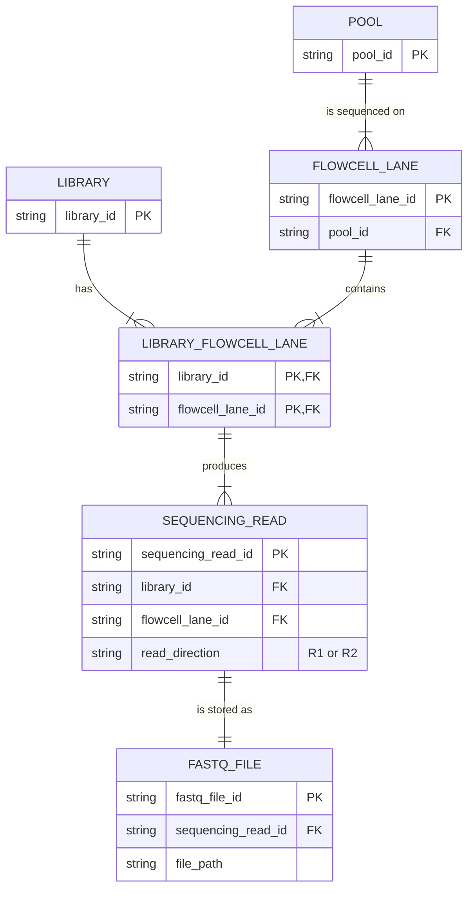
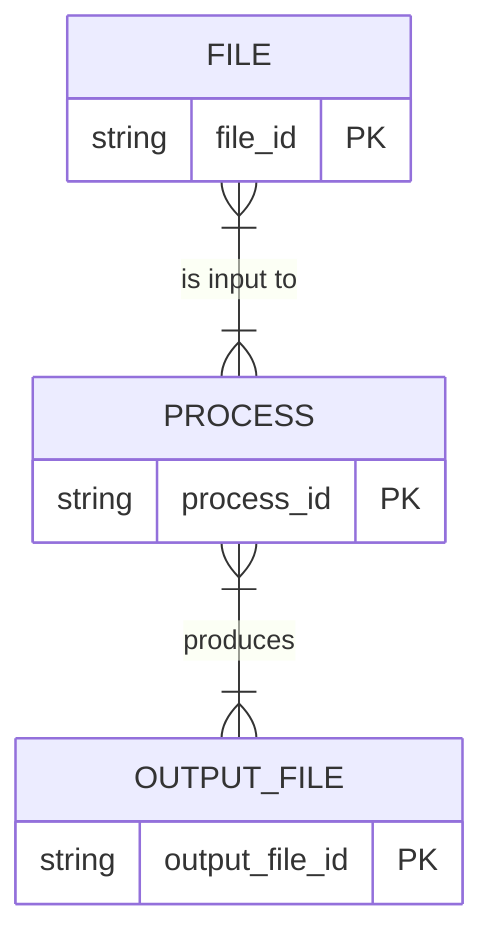
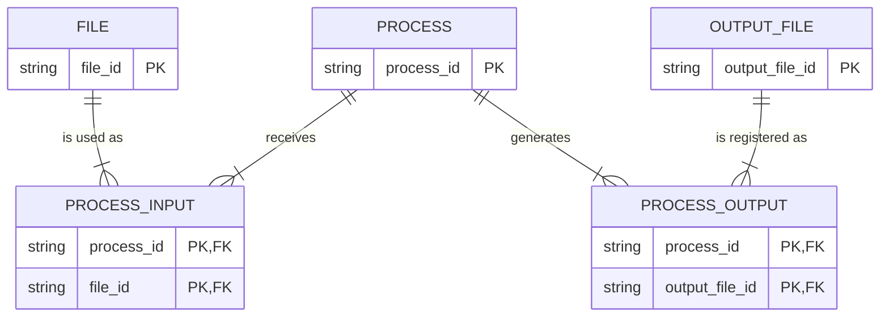
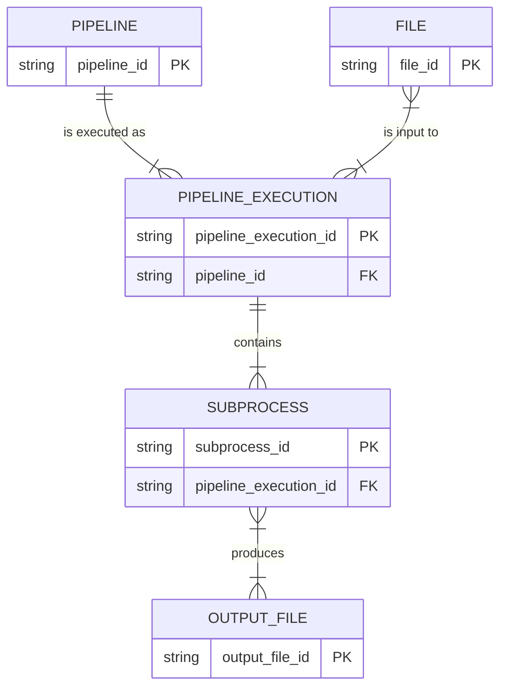
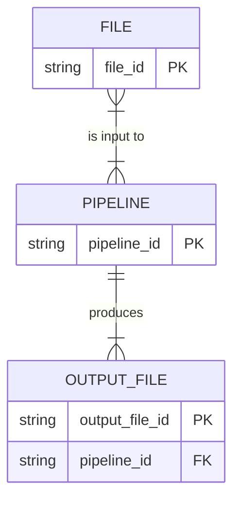
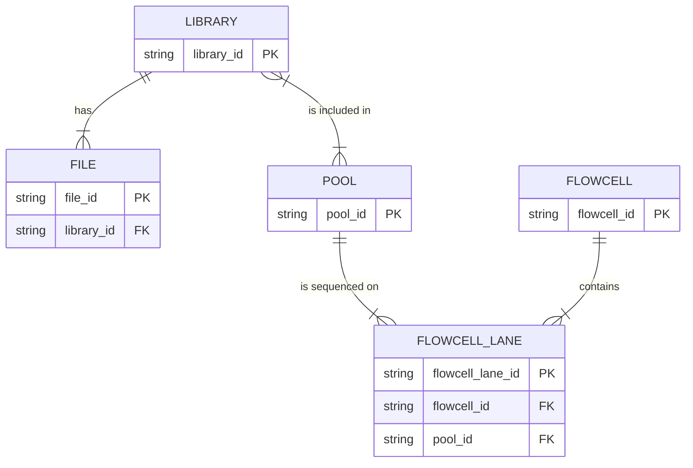

# All Mermaid ERD diagrams

## 1. Library, flowcell lane, sequencing read, and FASTQ file

## 2. File, process, and output file — conceptual model

## 3. File, process, and output file — relational implementation

## 4. Pipeline execution and subprocesses

## 5. Pipeline input and output files

## 6. Library, pool, flowcell lane, and file

