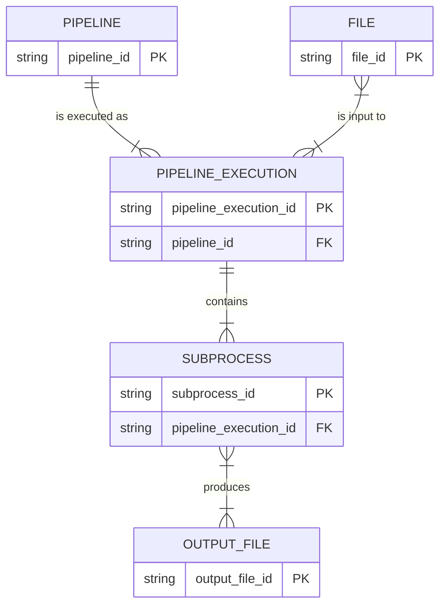

# Pipeline execution and subprocesses

```mermaid
erDiagram
    PIPELINE ||--|{ PIPELINE_EXECUTION : "is executed as"

    FILE }|--|{ PIPELINE_EXECUTION : "is input to"

    PIPELINE_EXECUTION ||--|{ SUBPROCESS : "contains"

    SUBPROCESS }|--|{ OUTPUT_FILE : "produces"

    PIPELINE {
        string pipeline_id PK
    }

    PIPELINE_EXECUTION {
        string pipeline_execution_id PK
        string pipeline_id FK
    }

    FILE {
        string file_id PK
    }

    SUBPROCESS {
        string subprocess_id PK
        string pipeline_execution_id FK
    }

    OUTPUT_FILE {
        string output_file_id PK
    }
```

The file-to-pipeline-execution relationship was interpreted as many-to-many because the handwritten cardinality markers were not fully clear.
