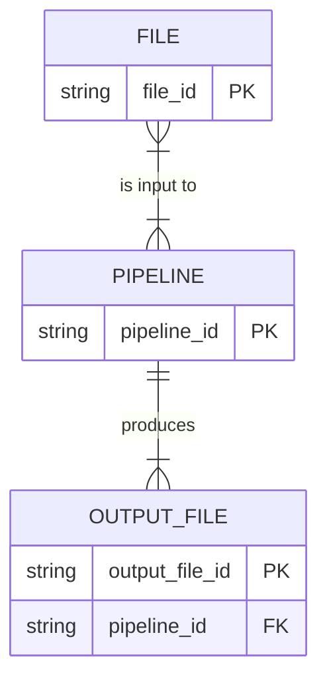

# Pipeline input and output files

```mermaid
erDiagram
    FILE }|--|{ PIPELINE : "is input to"
    PIPELINE ||--|{ OUTPUT_FILE : "produces"

    FILE {
        string file_id PK
    }

    PIPELINE {
        string pipeline_id PK
    }

    OUTPUT_FILE {
        string output_file_id PK
        string pipeline_id FK
    }
```

Interpretation: a pipeline uses one or more input files and produces one or more output files.
