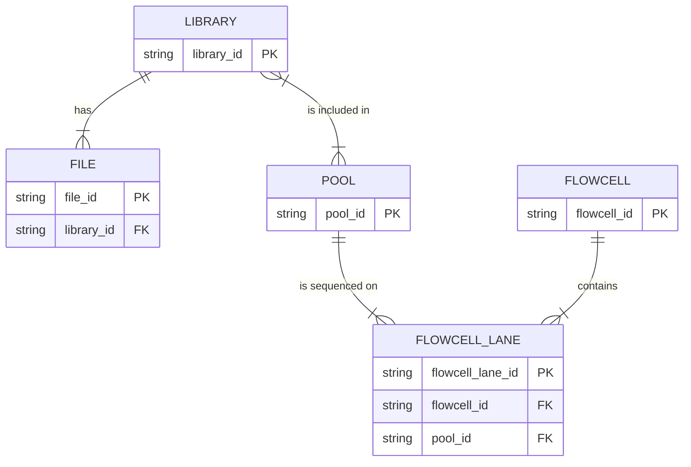

# Library, pool, flowcell lane, and file

Interpretation: libraries and pools have a many-to-many relationship; each pool is sequenced on one or more lanes; each flowcell contains one or more lanes.
