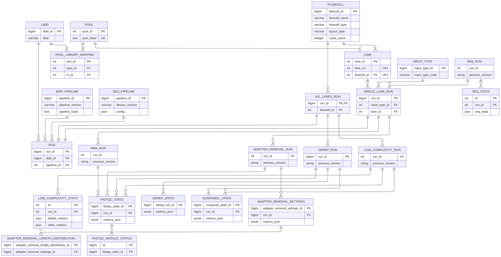

PROBLEM: Raw run stats are both produced by seq pipeline and binf pipeline

```mermaid
---
config:
  layout: elk
  er:
    layoutDirection: LR
    nodeSpacing: 190
    rankSpacing: 130
    entityPadding: 9
    minEntityWidth: 80
    minEntityHeight: 50
    fontSize: 11
    diagramPadding: 20
    useMaxWidth: false
---
erDiagram
    LIBID {
        bigint libid_id PK
        varchar libid
    }

    POOL {
        int pool_id PK
        text pool_label UK
    }

      POOL_LIBRARY_MAPPING {
        int plm_id PK
        int pool_id FK 
        int lv_id FK      
}

    FLOWCELL {
        bigint flowcell_id PK
        varchar flowcell_name
        varchar flowcell_type
        varchar layout_type
        integer cycle_count
    }
    
    LANE {
        int lane_id PK
        int lane_no "UK1"
        int flowcell_id FK "UK1"
    }

    BINF_PIPELINE {
        bigint pipeline_id PK
        varchar pipeline_version
        text pipeline_hash
    }

    SEQ_PIPELINE {
        bigint pipeline_id PK
        varchar demux_version
        json config
    }

    INPUT_TYPE {
        bigint input_type_id PK
        varchar input_type_code
    }

    RUN {
        bigint run_id PK
        bigint libid_id FK
        int pipeline_id FK
    }

    ALL_LANES_RUN {
        bigint run_id PK, FK
        int flowcell_id FK
    }

    SINGLE_LANE_RUN {
        bigint run_id PK
        int input_type_id FK
        int lane_id FK
    }

    RAW_RUN {
        int run_id
        string process_version
    }

    SEQ_RUN {
        int run_id
        string process_version
    }

    SEQ_STATS {
        int id PK
        int run_id FK
        json seq_stats
    }

    ADAPTER_REMOVAL_RUN {
        int run_id FK
        string process_version
    }

    DEREP_RUN {
        bigint run_id PK
        string process_version

    }

    LOW_COMPLEXITY_RUN {
        int run_id FK
        string process_version
    }

    LOW_COMPLEXITY_STATS {
        int id PK 
        int run_id FK
        json bbduk_metrics
        json other_metrics
    }

    FASTQC_STATS {
        bigint fastqc_stats_id PK
        bigint run_id FK
        jsonb metrics_json
    }

    DEREP_STATS {
        bigint derep_run_id PK
        jsonb metrics_json
    }

    NONPAREIL_STATS {
        bigint nonpareil_stats_id PK
        bigint run_id FK
        jsonb metrics_json
    }

    ADAPTER_REMOVAL_SETTINGS {
        bigint adapter_removal_settings_id PK
        bigint run_id FK
        jsonb metrics_json
    }

    ADAPTER_REMOVAL_LENGTH_DISTRIBUTION {
        bigint adapter_removal_length_distribution_id PK
        bigint adapter_removal_settings_id FK
    }

    FASTQC_MODULE_STATUS {
        bigint id PK
        bigint fastqc_stats_id FK
    }

    LIBID ||--o{ RUN : ""
    FLOWCELL ||--|{ LANE : ""
    BINF_PIPELINE ||--o{ RUN : ""
    SEQ_PIPELINE ||--o{ RUN : ""

    LIBID ||--|{ POOL_LIBRARY_MAPPING : ""
    POOL ||--|{ POOL_LIBRARY_MAPPING : ""
    POOL ||--|{ LANE : ""
  
    SINGLE_LANE_RUN ||--|| RUN : ""
    ALL_LANES_RUN ||--|| RUN : ""


    SINGLE_LANE_RUN ||--o{ ADAPTER_REMOVAL_RUN : ""
    ALL_LANES_RUN ||--o{ LOW_COMPLEXITY_RUN : ""
    ALL_LANES_RUN ||--o{ DEREP_RUN : ""
    SINGLE_LANE_RUN ||--o{ RAW_RUN : ""


    ADAPTER_REMOVAL_RUN ||--o{ ADAPTER_REMOVAL_SETTINGS : ""
    ADAPTER_REMOVAL_SETTINGS ||--o{ ADAPTER_REMOVAL_LENGTH_DISTRIBUTION : ""
    ADAPTER_REMOVAL_RUN ||--o{ FASTQC_STATS : ""

    LOW_COMPLEXITY_RUN ||--o{ FASTQC_STATS : ""
    LOW_COMPLEXITY_RUN ||--o{ LOW_COMPLEXITY_STATS : ""
    LOW_COMPLEXITY_RUN ||--o{ NONPAREIL_STATS : ""

    RAW_RUN ||--o{ FASTQC_STATS : ""
    SEQ_RUN ||--o{ SEQ_STATS : ""
    SEQ_RUN ||--o{ SINGLE_LANE_RUN : ""

    DEREP_RUN ||--o{ FASTQC_STATS : ""
    DEREP_RUN ||--o{ DEREP_STATS : ""
    DEREP_RUN ||--o{ NONPAREIL_STATS : ""

    INPUT_TYPE ||--o{ SINGLE_LANE_RUN : ""
    LANE ||--o{ SINGLE_LANE_RUN : ""
    FLOWCELL ||--o{ ALL_LANES_RUN : ""

    FASTQC_STATS ||--o{ FASTQC_MODULE_STATUS : ""
```