# Current `qc` schema — non-key columns only

This ERD reflects the 21 base tables in the live `smdb.qc` schema on
2026-07-29. It lists only columns that do **not** participate in a primary-key,
foreign-key, or unique constraint. Relationships are retained even though
their foreign-key columns are intentionally hidden.

```mermaid
erDiagram
    qc_run {
        date sequencing_date
        varchar flowcell_position
        timestamp_with_time_zone smdb_insert_at
        text mapping_results_id
        jsonb config
        text config_source_file
    }

    adapter_removal_settings {
        text source_file
        text adapter_removal_version
        text mode
        text adapter1_1
        text adapter2_1
        text rng_seed
        integer alignment_shift_value
        numeric global_mismatch_threshold
        text quality_format_input
        integer quality_score_max_input
        text quality_format_output
        integer quality_score_max_output
        text mate_number_separator_input
        integer trimming_5p
        integer trimming_3p
        boolean trimming_ns
        boolean trimming_phred_scores_le_2
        boolean trimming_using_sliding_windows
        integer minimum_genomic_length
        bigint maximum_genomic_length
        boolean collapse_overlapping_reads
        boolean deterministic_collapse
        boolean conservative_collapse
        integer minimum_overlap_in_case_of_collapse
        bigint total_number_of_read_pairs
        bigint number_of_unaligned_read_pairs
        bigint number_of_well_aligned_read_pairs
        bigint number_of_discarded_mate_1_reads
        bigint number_of_singleton_mate_1_reads
        bigint number_of_discarded_mate_2_reads
        bigint number_of_singleton_mate_2_reads
        bigint number_of_reads_with_adapters_1
        bigint number_of_full_length_collapsed_pairs
        bigint number_of_truncated_collapsed_pairs
        bigint number_of_retained_reads
        bigint number_of_retained_nucleotides
        numeric average_length_of_retained_reads
    }

    adapter_removal_length_distribution {
        bigint mate1
        bigint mate2
        bigint singleton
        bigint collapsed
        bigint collapsed_truncated
        bigint discarded
        bigint all_reads
    }

    bbduk_stats {
        text bbduk_version
        numeric entropy
        integer entropy_window
        integer entropy_k
        bigint input_reads
        bigint input_bases
        bigint contaminant_reads
        numeric contaminant_reads_pct
        bigint contaminant_bases
        numeric contaminant_bases_pct
        bigint low_entropy_reads
        numeric low_entropy_reads_pct
        bigint low_entropy_bases
        numeric low_entropy_bases_pct
        bigint total_removed_reads
        numeric total_removed_reads_pct
        bigint total_removed_bases
        numeric total_removed_bases_pct
        bigint result_reads
        numeric result_reads_pct
        bigint result_bases
        numeric result_bases_pct
        numeric processing_time_seconds
        text ref
        timestamp_with_time_zone smdb_insert_at
        varchar flowcell_position
    }

    derep_stats {
        bigint duplicated_records_removed
        text source_file
        timestamp_with_time_zone smdb_insert_at
        varchar data_type
    }

    fastqc_stats {
        text filename
        text file_type
        text encoding
        bigint total_sequences
        text total_bases
        bigint poor_quality_sequences
        text sequence_length
        integer gc_percent
        text fastqc_version
        timestamp_with_time_zone smdb_insert_at
    }

    fastqc_adapter_content {
        numeric illumina_universal
        numeric illumina_small_rna_3
        numeric illumina_small_rna_5
        numeric nextera_transposase
        numeric poly_a
        numeric poly_g
        timestamp_with_time_zone smdb_insert_at
    }

    fastqc_kmer_content {
        bigint count
        numeric obs_exp_max
        text obs_exp_max_at
        timestamp_with_time_zone smdb_insert_at
    }

    fastqc_module_status {
        text status
        timestamp_with_time_zone smdb_insert_at
    }

    fastqc_overrepresented_sequences {
        bigint count
        numeric percentage
        text source
        timestamp_with_time_zone smdb_insert_at
    }

    fastqc_per_base_n_content {
        numeric n_count
        timestamp_with_time_zone smdb_insert_at
    }

    fastqc_per_base_quality {
        numeric mean
        numeric median
        numeric lower_quartile
        numeric upper_quartile
        numeric percentile_10
        numeric percentile_90
        timestamp_with_time_zone smdb_insert_at
    }

    fastqc_per_base_sequence_content {
        numeric g
        numeric a
        numeric t
        numeric c
        timestamp_with_time_zone smdb_insert_at
    }

    fastqc_per_sequence_gc_content {
        numeric count
        timestamp_with_time_zone smdb_insert_at
    }

    fastqc_per_sequence_quality {
        numeric count
        timestamp_with_time_zone smdb_insert_at
    }

    fastqc_per_tile_quality {
        numeric mean
        timestamp_with_time_zone smdb_insert_at
    }

    fastqc_sequence_duplication_levels {
        numeric total_deduplicated_pct
        numeric percentage_of_total
        timestamp_with_time_zone smdb_insert_at
    }

    fastqc_sequence_length_distribution {
        numeric count
        timestamp_with_time_zone smdb_insert_at
        double_precision length_midpoint
    }

    nonpareil_stats {
        numeric kappa
        numeric c
        numeric lr
        numeric model_r
        numeric lr_star
        numeric diversity
        text source_file
        timestamp_with_time_zone smdb_insert_at
    }

    samtools_stats {
        text source_file
        text samtools_version
        text command_line
        bigint raw_total_sequences
        bigint filtered_sequences
        bigint sequences
        integer is_sorted
        bigint first_fragments
        bigint last_fragments
        bigint reads_mapped
        bigint reads_mapped_and_paired
        bigint reads_unmapped
        bigint reads_properly_paired
        bigint reads_paired
        bigint reads_duplicated
        bigint reads_mq0
        bigint reads_qc_failed
        bigint non_primary_alignments
        bigint supplementary_alignments
        bigint total_length
        bigint total_first_fragment_length
        bigint total_last_fragment_length
        bigint bases_mapped
        bigint bases_mapped_cigar
        bigint bases_trimmed
        bigint bases_duplicated
        bigint mismatches
        numeric error_rate
        numeric average_length
        numeric average_first_fragment_length
        numeric average_last_fragment_length
        bigint maximum_length
        bigint maximum_first_fragment_length
        bigint maximum_last_fragment_length
        numeric average_quality
        numeric insert_size_average
        numeric insert_size_standard_deviation
        bigint inward_oriented_pairs
        bigint outward_oriented_pairs
        bigint pairs_with_other_orientation
        bigint pairs_on_different_chromosomes
        numeric percentage_of_properly_paired_reads_pct
        timestamp_with_time_zone smdb_insert_at
    }

    audit_log {
        text table_name
        text operation
        jsonb old_row
        jsonb new_row
        timestamp_with_time_zone changed_at
        text changed_by
        text schema_name
    }

    qc_run ||--o{ adapter_removal_settings : identifies
    adapter_removal_settings ||--o{ adapter_removal_length_distribution : has

    qc_run ||--o{ bbduk_stats : identifies
    qc_run ||--o{ derep_stats : identifies
    qc_run ||--o{ fastqc_stats : identifies
    qc_run ||--o{ nonpareil_stats : identifies
    qc_run ||--o{ samtools_stats : identifies

    fastqc_stats ||--o{ fastqc_adapter_content : has
    fastqc_stats ||--o{ fastqc_kmer_content : has
    fastqc_stats ||--o{ fastqc_module_status : has
    fastqc_stats ||--o{ fastqc_overrepresented_sequences : has
    fastqc_stats ||--o{ fastqc_per_base_n_content : has
    fastqc_stats ||--o{ fastqc_per_base_quality : has
    fastqc_stats ||--o{ fastqc_per_base_sequence_content : has
    fastqc_stats ||--o{ fastqc_per_sequence_gc_content : has
    fastqc_stats ||--o{ fastqc_per_sequence_quality : has
    fastqc_stats ||--o{ fastqc_per_tile_quality : has
    fastqc_stats ||--o{ fastqc_sequence_duplication_levels : has
    fastqc_stats ||--o{ fastqc_sequence_length_distribution : has
```

## Notes

- The diagram contains 191 non-key columns.
- Primary-key, foreign-key, and unique-constraint columns are all hidden.
- Relationship lines still represent the schema's foreign-key constraints.
- `audit_log` has no declarative foreign key; triggers populate it.
- `end_user_available_stats` and `end_user_available_stats_wide` are omitted
  because they are a view and materialized view, respectively.
