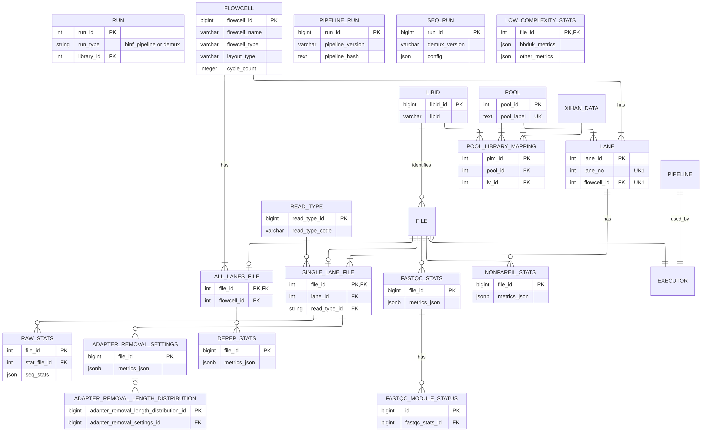

```mermaid
---
config:
  layout: elk
  er:
    layoutDirection: LR
    nodeSpacing: 190
    rankSpacing: 130
    entityPadding: 9
    minEntityWidth: 80
    minEntityHeight: 50
    fontSize: 11
    diagramPadding: 20
    useMaxWidth: false
---
erDiagram
    LIBID {
        bigint libid_id PK
        varchar libid
    }

    POOL {
        int pool_id PK
        text pool_label UK
    }

      POOL_LIBRARY_MAPPING {
        int plm_id PK
        int pool_id FK 
        int lv_id FK      
    }

    RUN {
        int run_id PK
        string run_type "binf_pipeline or demux"
        int library_id FK
    }

    ALL_LANES_FILE {
        int file_id PK, FK
        int flowcell_id FK
    }

    SINGLE_LANE_FILE {
        int file_id PK, FK
        int lane_id FK
        string read_type_id FK
    }

    FLOWCELL {
        bigint flowcell_id PK
        varchar flowcell_name
        varchar flowcell_type
        varchar layout_type
        integer cycle_count
    }
    
    LANE {
        int lane_id PK
        int lane_no "UK1"
        int flowcell_id FK "UK1"
    }

    PIPELINE_RUN {
        bigint run_id PK
        varchar pipeline_version
        text pipeline_hash
    }

    SEQ_RUN {
        bigint run_id PK
        varchar demux_version
        json config
    }

    READ_TYPE {
        bigint read_type_id PK
        varchar read_type_code
    }

    RAW_STATS {
        int file_id PK
        int stat_file_id FK
        json seq_stats
    }

    ADAPTER_REMOVAL_SETTINGS {
        bigint file_id PK
        jsonb metrics_json
    }

    ADAPTER_REMOVAL_LENGTH_DISTRIBUTION {
        bigint adapter_removal_length_distribution_id PK
        bigint adapter_removal_settings_id FK
    }

    LOW_COMPLEXITY_STATS {
        int file_id PK, FK
        json bbduk_metrics
        json other_metrics
    }

    FASTQC_STATS {
        bigint file_id PK
        jsonb metrics_json
    }

    DEREP_STATS {
        bigint file_id PK
        jsonb metrics_json
    }

    NONPAREIL_STATS {
        bigint file_id PK
        jsonb metrics_json
    }
    
    FASTQC_MODULE_STATUS {
        bigint id PK
        bigint fastqc_stats_id FK
    }


    READ_TYPE ||--o{ SINGLE_LANE_FILE : ""
    LIBID ||--o{ FILE : identifies
    FLOWCELL ||--|{ ALL_LANES_FILE : has
    FLOWCELL ||--|{ LANE : has
    LANE ||--|{ SINGLE_LANE_FILE : has
    PIPELINE ||--|| EXECUTOR : used_by
    FILE }|--|| EXECUTOR : ""
    FILE ||--o| SINGLE_LANE_FILE : ""
    FILE ||--o| ALL_LANES_FILE : ""


    LIBID ||--|{ POOL_LIBRARY_MAPPING : ""
    POOL ||--|{ POOL_LIBRARY_MAPPING : ""
    XIHAN_DATA ||--|{ POOL_LIBRARY_MAPPING : ""
    POOL ||--|{ LANE : ""
    

    SINGLE_LANE_FILE ||--o{ RAW_STATS : "" 
    SINGLE_LANE_FILE ||--o{ ADAPTER_REMOVAL_SETTINGS : ""
    FILE ||--o{ FASTQC_STATS : ""
    FILE ||--o{ NONPAREIL_STATS : ""
    ALL_LANES_FILE ||--o{ DEREP_STATS : ""

    ADAPTER_REMOVAL_SETTINGS ||--o{ ADAPTER_REMOVAL_LENGTH_DISTRIBUTION : ""
    FASTQC_STATS ||--o{ FASTQC_MODULE_STATUS : has


```