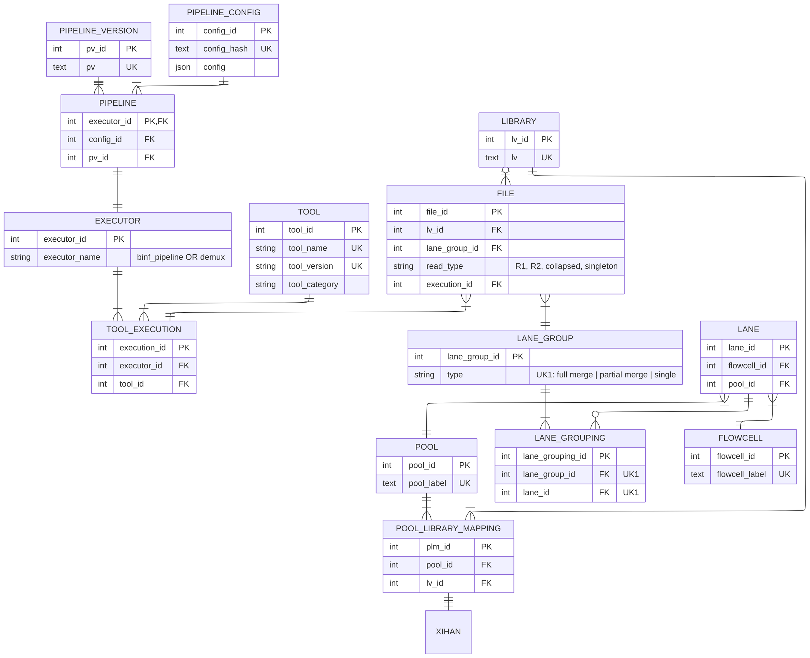

NOTE:
 1. An executor of a tool can either be a binf pipeline or sequencing pipeline. Binf pipeline has its own table because it has specific fields defining it. Seq pipeline does not as far as I am aware.
 2. A lane group is simply a helper table. A lane group is defined as a group of lanes. A group of lanes can consist of 1 or many lanes. The lane grouping table defines which lanes are part of which group. This makes it possible for a statfile to refer to single lanes (single lane files) and multiple lanes (merged files).

